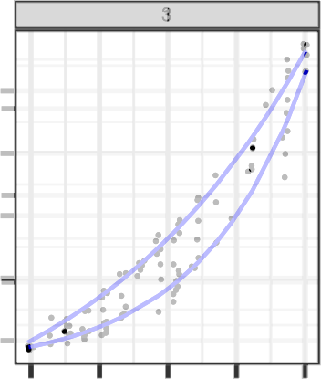

```{r setup2, include = F}
options(width = 60)
options(tinytex.clean = FALSE)

knitr::opts_chunk$set(
  echo = F, 
  eval = T, 
  message = F, 
  warning = F,
  fig.width = 6, 
  fig.height = 4,  
  fig.align = 'center',
  out.width = "\\linewidth", 
  dpi = 300, 
  tidy = T, tidy.opts=list(width.cutoff=45),
  fig.pos = "tbp",
  out.extra = "",
  cache = FALSE
)

library(readr)
library(tidyverse)
library(ggtext)
library(scales)
library(knitr)
library(gridExtra)
library(patchwork)
library(cowplot)
library(ggh4x)
library(ggmosaic)
# library(ggforce)
# library(formatR)
```

```{r data}
lineup_model_data <- read_csv("supplementary-materials/lineup-model-data.csv",
                              col_types = cols(response_no = col_character())
                              ) |> 
  mutate(conf_level = factor(conf_level, levels = c("Very Certain", "Certain", "Neutral", "Uncertain", "Very Uncertain"))) |>
  mutate(conf_level_num = as.numeric(conf_level))
```

\renewcommand{\thesection}{A}
\setcounter{figure}{0}    
\renewcommand\thefigure{\thesection\arabic{figure}}  
\setcounter{equation}{0}    
\renewcommand\theequation{\thesection\arabic{equation}}  


# Exponential growth rates and curvature

Let us consider a simple equation, distinct from the one employed to simulate data in our study. This equation can be used to simulate data which grows exponentially in $x$, with optional error term $\epsilon$: \begin{align}y &= \exp\{\beta_1 x + \epsilon\}\quad \text{where}\quad \epsilon \sim N(0, \sigma).\label{eq:simpleexp}\end{align}

```{r simple-exponential, echo = F, fig.width = 8, fig.height = 3, out.width = "\\linewidth", fig.cap = "Linear and log scale simple exponential equations as specified in \\cref{eq:simpleexp}, with error term excluded. The y-axis endpoints are a primary visual signal when differentiating between the lines in both plots.", fig.pos = 'hb'}
library(tidyverse)

df <- crossing(tibble(b1 = c(0.06, 0.13, 0.23),
                      eps = c(0.05, 0.12, 0.25)), 
               tibble(x = seq(1, 10, .01))) %>%
  mutate(y = exp(b1*x),
         yvar = exp(b1*x + rnorm(n(), 0, eps))) %>%
  mutate(e0 = paste0("epsilon == ", eps),
         b1 = paste0("beta[1] == ", b1))

logplot <- ggplot(df, aes(x = x, y = y, color = b1)) + 
  geom_line(size = 1) +
  scale_y_continuous(labels = scales::comma) + 
  scale_color_manual("Slope", 
                     labels = expression(beta[1]==0.06, beta[1]==0.13, beta[1]==0.23), 
                     values = c("#1B9E77", "#D95F02", "#7570B3"),
                     guide = guide_legend(reverse = TRUE)) + 
  theme_bw()  + 
  theme(axis.title = element_blank(), 
        axis.text.y = element_text(angle = 90, hjust = .5, vjust = .5),
        legend.position = c(0.01, 0.99), 
        legend.justification = c(0, 1), 
        legend.box = "horizontal")

linearplot <- ggplot(df, aes(x = x, y = y, color = b1)) + 
  geom_line(size = 1) +
  scale_y_log10(labels = scales::comma) + 
  scale_color_manual("Slope", 
                     labels = expression(beta[1]==0.06, beta[1]==0.13, beta[1]==0.23),
                     values = c("#1B9E77", "#D95F02", "#7570B3"),
                     guide = guide_legend(reverse = TRUE)) + 
  theme_bw()  + 
  guides(color = "none") + 
  theme(axis.title = element_blank(), 
        axis.text.y = element_text(angle = 90, hjust = .5, vjust = .5),
        legend.position = c(0.01, 0.99), 
        legend.justification = c(0, 1), 
        legend.box = "horizontal")

#logplot + linearplot
gridExtra::grid.arrange(logplot, linearplot, ncol = 2)
```

It is important in lineup studies to control for extraneous visual signals, and when other visual signals creep in, results of the study can be difficult to interpret [@vanderplas_clusters_2017].

In this particular case, the extraneous visual signals are the endpoints of the lines (the endpoint at $x=10$ on a linear scale, and both endpoints on the log scale), as shown in 
\cref{fig:simple-exponential}. 
Preattentive features guide attention [@wolfeWhatPreattentiveFeature2019]; one of the first things we do when scanning a graph is to notice the extent of the data within the axes. 
We must control the endpoints to ensure that participants are using active attention to assess the lineup and draw conclusions, so that the whole visual signal is processed as part of the lineup evaluation; if participants are making decisions off of the endpoints, then we cannot interpret the results to say that they are assessing the rate of exponential growth rather than the end result.

There are several different options for controlling the visual signal in a lineup: 

0. Do nothing and set each subplot's limits to the overall maximum limits.
1. allow each subplot to have different axis limits
2. truncate the displayed range of each subplot to the minimum range generated in the lineup
3. add extra parameters to the exponential equation to adjust the range of the data so that it fits within a pre-specified domain, as in \cref{alg:lineup-exponential-data-simulation-algorithm}.

```{r gen-data-sample, include = F}
set.seed(30204)
param_order <- sample(c(1, rep(2, 19)), size = 20, replace = F)

tmp <- crossing(
  tibble(x = seq(0, 20, length.out = floor(50/3))),
  tibble(plot = 1:20, 
         beta1 = c(0.06, 0.13)[param_order],
         alphatilde = c(37.22, 6.82)[param_order],
         thetahat = c(-27.26, 3.14)[param_order],
         sigma = c(0.05, 0.12)[param_order])
  ) %>%
    group_by(plot) %>%
    sample_n(50, replace = T) %>%
    ungroup() %>%
  mutate(x = jitter(x)) %>%
  mutate(y = exp(beta1*x),
         yvar = exp(beta1*x + rnorm(n(), 0, sigma)),
         yscale = alphatilde*y + thetahat,
         yscalevar = alphatilde * yvar + thetahat) %>%
  arrange(plot, x)

```

```{r lineup-fixed-scales, dpi= 300, fig.width = 7.5, fig.height = 6, out.width = ".6\\linewidth", fig.cap = "When axis limits are fixed to the most expansive extent in the generated data, the primary signal becomes the extent of the domain which has data, rather than the growth rate itself."}
ggplot(tmp, aes(x = x)) + 
  facet_wrap(~plot, ncol = 5, scales = "fixed") + 
  geom_point(aes(y = yvar), size = .05) +
  geom_line(aes(y = y), color = "blue") + 
  theme(aspect.ratio = 1) +
  theme_bw(base_size = 14) +
  theme(axis.title.y = element_blank(),
        axis.title.x = element_blank(),
        axis.text.x = element_blank(),
        axis.text.y = element_blank(),
        strip.text = element_text(size = 5, margin = margin(0.05,0,0.05,0, "cm")),
        strip.background = element_rect(linewidth = 0.5)
  )
```

Typically, lineups do not show axis labels or scaling, because the goal is to assess the signal from the data without additional context. In addition, the traditional 20-panel lineup would be quite visually confusing in this circumstance:

```{r lineup-free-scales, fig.show = 'hold', dpi= 300, fig.width = 7.5, fig.height = 6, out.width = c(".6\\linewidth", ".2\\linewidth"), fig.subcap = c("Lineup", "Overlay of null and signal panels."), fig.cap = "When y-axis limits vary by panel, the y-axis labels are the primary visual signal; the secondary signal (when the panels are overlaid) is the curvature of the line."}

ggplot(tmp, aes(x = x)) + 
  facet_wrap(~plot, ncol = 5, scales = "free") + 
  geom_point(aes(y = yvar), size = .05) +
  geom_line(aes(y = y), color = "blue") + 
  theme(aspect.ratio = 1) +
  theme_bw(base_size = 14) +
  theme(axis.title.y = element_blank(),
        axis.title.x = element_blank(),
        axis.text.x = element_blank(),
        strip.text = element_text(size = 5, margin = margin(0.05,0,0.05,0, "cm")),
        strip.background = element_rect(linewidth = 0.5)
  )


```

\cref{fig:lineup-free-scales} demonstrates that when we ignore the y-axis labels and overlay the signal panel with one of the null panels, the remaining difference is the curvature of the line. 
If we want to keep the standard convention of not including y-axis labels in lineups for simplicity and to reduce plot clutter, this alternative signal seems promising (and as we will show, is approximately equivalent to option 3).

Let us next consider option 2: Crop each panel to the minimum limits of all generated data. The result is shown in \cref{fig:lineup-truncate-scales}. This operation shifts which axis becomes the visually important factor, but doesn't change the problem: previously the issue was the y-axis extent, now it is the x-axis extent. Both of these parameters are implicitly affected by how we generate exponential data. In order to truly assess whether people can discriminate between comparable exponential growth rates graphically, it is more useful to approach the problem from a curvature perspective rather than to artificially limit the data shown.

This issue is a fundamental problem when testing graphics: the test must meet the "goldilocks" standard - not too hard, not too easy, but just right. Both option 0 and option 2 fail this standard.

```{r lineup-truncate-scales, dpi= 300, fig.width = 7.5, fig.height = 6, out.width = ".6\\linewidth", fig.cap = "When axis limits are fixed to the most restrictive in all generated data, the primary signal becomes the extent of the x axis which is covered with data, rather than the growth rate itself."}
lims <- tmp %>% 
  group_by(plot) %>% 
  summarize(xmin = min(x), xmax = max(x), 
            ymin = min(y), ymax = max(y),
            yvarmin = min(c(yvar, y)), yvarmax = max(c(y, yvar))) %>%
  summarize(xmin = max(xmin), xmax = min(xmax),
            ymin = max(ymin), ymax = min(ymax),
            yvarmin = max(yvarmin), yvarmax = min(yvarmax))

ggplot(tmp, aes(x = x)) + 
  facet_wrap(~plot, ncol = 5) + 
  geom_point(aes(y = yvar), size = .05) +
  geom_line(aes(y = y), color = "blue") + 
  coord_cartesian(xlim = c(lims$xmin, lims$xmax),
                  ylim = c(lims$ymin, lims$ymax)) + 
  theme(aspect.ratio = 1) +
  theme_bw(base_size = 14) +
  theme(axis.title.y = element_blank(),
        axis.title.x = element_blank(),
        axis.text.x = element_blank(),
        axis.text.y = element_blank(),
        strip.text = element_text(size = 5, margin = margin(0.05,0,0.05,0, "cm")),
        strip.background = element_rect(linewidth = 0.5)
  )
```

Visually, both the $x$ and $y$ axes matter equally, even if it might on paper make sense to truncate $x$ in order to control the $y$ axis range. 

An additional benefit of controlling endpoints is that it also provides some realism: our goal was to assess the ability to examine exponential growth **rates**, motivated by the COVID-19 pandemic. As each geographic reporting region started with different numbers of cases and had different control policies, the $\alpha$ and $\theta$ parameters are reasonable to represent some of these differences while still examining the underlying exponential behavior. 

To control these endpoints on both scales then we have to move to an exponential model that is a bit more complicated: 
\begin{align}y = \alpha \cdot \exp\left\{\beta_1 x + \epsilon\right\} + \theta\quad \text{where}\quad \epsilon \sim N(0, \sigma).\label{eq:complexexp}\end{align}

$\alpha$ and $\theta$ were used to make endpoints consistent among the growth rates. As a result, the lineups examine the degree of inflection of the trend rather than the explicit exponential growth rate. An explanation for how the ultimate values for $\alpha$ and $\theta$ were determined is provided in  \cref{alg:lineup-exponential-data-simulation-algorithm}. \cref{fig:lineup-scale-data} uses the parameters  in \cref{tab:parameter-data} and the data generating method described in \cref{alg:lineup-exponential-data-simulation-algorithm}. The result is a series of panels which have obvious variation due to the points (a desirable feature) but where the underlying relationship shown in blue has consistent endpoints. As a result, the question becomes whether participants can identify that plot 3 has a different growth rate (as measured by the curvature of the line). 

```{r lineup-scale-data, dpi= 300, fig.width = 7.5, fig.height = 6, out.width = ".6\\linewidth", fig.cap = "When the data are scaled such that endpoints are similar across all conditions, the primary feature becomes the curvature of the line, while individual plots show random variation due to the scatter around the line."}
ggplot(tmp, aes(x = x)) + 
  facet_wrap(~plot, ncol = 5) + 
  geom_point(aes(y = yscalevar), size = .05) +
  geom_line(aes(y = yscale), color = "blue") + 
  theme(aspect.ratio = 1) +
  theme_bw(base_size = 14) +
  theme(axis.title.y = element_blank(),
        axis.title.x = element_blank(),
        axis.text.x = element_blank(),
        axis.text.y = element_blank(),
        strip.text = element_text(size = 5, margin = margin(0.05,0,0.05,0, "cm")),
        strip.background = element_rect(linewidth = 0.5)
  )
```

<!-- \renewcommand{\thesection}{B} -->
<!-- # Rorschach Lineup Evaluation -->

<!-- In addition to the experimental lineups, we generated three sets of homogeneous "Rorschach" lineups, each featuring panels simulated from the same distribution. Importantly, participants were unaware that there was no designated target panel for identification. \cref{fig:rorschach-lineups} illustrates the selection proportions for each panel on the "Rorschach" lineups corresponding to different curvature combinations and replicated data sets, when presented on both log and linear scales. Notably, the panel number is irrelevant, and the darker shade (bottom) denotes panels chosen more frequently than others. Addtionally, @vanderplas2021statistical provides an approach for calculating the statistical significance of lineups using a Dirichlet distribution. In particular, we are interested in calculating the parameter, $\alpha$, of the Dirichlet distribution that best fits the Rorschach lineups. An $\alpha < 0.05$ indicates only one panel in the lineup was selected more frequently than others, whereas an $\alpha > 0.25$ provides support that participant selections are evenly divided across many interesting panels. We computed the $\alpha$ values using the `estimate_alpha_numeric` function from the vinference R package [@Hofmann2020]. This approach allows us to explore whether any null panels were significantly more unique, providing insights into the null plot sampling method. -->

<!-- The plots in \cref{fig:rorschach-lineups} exhibit a relatively even distribution, offering multiple candidates for the most interesting panel. Additionally, most $\alpha$ values are calculated to be above 0.25, indicating participant attention is divided across multiple interesting panels. It is worth noting that in the low curvature "Rorschach" lineups simulated in data set replication one, a single panel stands out, with over 50\% of participants selecting the same null panel on the linear scale and just under 50\% on the log scale. This particular lineup yields an $\alpha = 0.17$ indicating that while the panel selection is not evenly distributed, there are more than one interesting panel. It is also worth noting that set two of the low curvature lineup results in a larger $\alpha = 0.4.$ Through a visual examination of "Rorschach" evaluations and calculation of $\alpha$ parameters, we determined that our null sampling method is appropriate. -->

<!-- ```{r, rorschach-lineups, dpi = 300, fig.width = 9, fig.height = 7, fig.cap = "Observed proportions of panel selections for the 'Rorschach' lineups. The darker shade (bottom) denotes panels chosen more frequently than others."} -->
<!-- lineup_rorschach_data <- read_csv("supplementary-materials/lineup-rorschach-data.csv") |>  -->
<!--   mutate(conf_level = factor(conf_level, levels = c("Very Certain", "Certain", "Neutral", "Uncertain", "Very Uncertain"))) |>  -->
<!--   mutate(conf_level_num = as.numeric(conf_level)) -->

<!-- # Calculate alphas -->
<!-- # install.packages("devtools") -->
<!-- # devtools::install_github("heike/vinference") -->
<!-- library(vinference) -->
<!-- npanels = 20 -->

<!-- calcAlpha <- function(data, m0 = 20) { -->

<!--   K = nrow(data) -->
<!--   c = m0/K -->
<!--   zc = data |> -->
<!--     select(response_no) |>  -->
<!--     count(response_no) |>  -->
<!--     arrange(-n) |>  -->
<!--     filter(n >= c) |>  -->
<!--     nrow() -->

<!--   results <- estimate_alpha_numeric(Zc = zc, -->
<!--                          c = c, -->
<!--                          m0 = m0, -->
<!--                          K  = K -->
<!--                          ) -->

<!--   return(results$alpha) -->
<!-- } -->

<!-- alpha_values <- lineup_rorschach_data |>  -->
<!--   nest(-target, -set, -scale) |>  -->
<!--   arrange(target, set, scale) |>  -->
<!--   mutate(alpha = map(.x = data, -->
<!--                      .f = calcAlpha) -->
<!--          ) |>  -->
<!--   unnest(alpha) |>  -->
<!--   mutate(target = fct_relevel(target, -->
<!--                               c("H", "M", "E"))) |>  -->
<!--   select(set, target, scale, alpha) -->

<!-- # unique(lineup_rorschach_data$dataset_id) |> length() -->
<!-- target_level <- c( -->
<!--   "H" = "Low Curvature", -->
<!--   "M" = "Moderate Curvature", -->
<!--   "E" = "High Curvature" -->
<!-- ) -->

<!-- library(RColorBrewer) -->
<!-- nb.cols <- 16 -->
<!-- mycolors <- colorRampPalette(brewer.pal(16, "Greens"))(nb.cols) -->

<!-- freqNum = function(data){ -->
<!--   data2 <- data |>  -->
<!--     mutate(freq_order = 1:n()) -->
<!--   return(data2) -->
<!-- } -->

<!-- rorschach_summary <- lineup_rorschach_data |>  -->
<!--   mutate(target = fct_relevel(target, -->
<!--                               c("H", "M", "E"))) |>  -->
<!--   group_by(evaluation_id, dataset_id, set, target, scale) |> -->
<!--   mutate(weight = 1/n()) |> -->
<!--   ungroup() |>  -->
<!--   group_by(dataset_id, set, target, scale) |> -->
<!--   count(response_no, wt = weight) |>  -->
<!--   arrange(dataset_id, set, target, scale, -n) |>  -->
<!--   nest(data = c(response_no, n)) |> -->
<!--   mutate(data2 = map(data, freqNum)) |>  -->
<!--   unnest(data2) |>  -->
<!--   select(-data) -->

<!-- rorschach_summary |>  -->
<!--   ggplot(aes(x = as.factor(set), -->
<!--              y = n -->
<!--              ) -->
<!--          ) + -->
<!--   geom_bar(stat = "identity", -->
<!--            position = "fill", -->
<!--            show.legend = F, -->
<!--            aes(fill = fct_rev(as.factor(freq_order))) -->
<!--            ) + -->
<!--   geom_text(data = alpha_values, -->
<!--             aes(label = paste0("alpha ==", round(alpha, 2)),  -->
<!--                 y = 1.05 -->
<!--                 ), -->
<!--             size = 3, -->
<!--             parse = TRUE -->
<!--             ) + -->
<!--   facet_grid(scale ~ target,  -->
<!--              scales = "free_x", -->
<!--              labeller = labeller(target = target_level) -->
<!--              ) + -->
<!--   theme_bw() + -->
<!--   scale_fill_manual(values = mycolors) + -->
<!--   labs(x = "Set", -->
<!--        y = "Proportion of Selections", -->
<!--        fill = "Identification") -->
<!-- ``` -->

<!-- ```{r eval = false} -->

<!-- # Number of Selections -->
<!-- lineup_rorschach_data |>  -->
<!--   count(target) -->

<!-- # Number of Evaluations -->
<!-- lineup_rorschach_data |>  -->
<!--   distinct(dataset_id, participant_id, target, scale) |>  -->
<!--   count(target) -->
<!-- ``` -->

\renewcommand{\thesection}{B}
# Participant confidence and accuracy

In addition to investigating how scale and curvature rate influence participant accuracy, we asked participants to indicate their level of confidence on a five-point Likert scale by answering, "How certain are you?" \cref{fig:conf-mosaic} shows the observed confidence rating proportions for correct and incorrect identifications across the different scale and curvature combination scenarios. We conducted a linear mixed model using the lmer function from the lme4 [@lme4] R package in order to determine how participant confidence (5 - Very Certain to 1 - Very Uncertain) varied across conditions. We included curvature combination, scale, accuracy (correct or incorrect), and all two- and three-way interactions along with a random participant effect. While there are limitations to assuming normality of Likert scale data, we evaluated model fit by observing residuals and comparing the results to non-parametric and multinomial methods. Due to the interpretability of the linear mixed model, we proceed to present the findings from this analysis. Overall, on average, individuals who were correct are 0.556 (se 0.039) Likert scale points more confident than individuals who were incorrect in their plot choice across all conditions (F = 214.57; df = 1, 3709; p < 0.0001). We did not find convincing evidence of a discernable difference in confidence levels between scales (F = 3.70; df = 1, 3709; p = 0.054). Overall, on average, lineups evaluated on the log scale indicated participants were 0.075 (se 0.0366) Likert scale points more confident than lineups evaluated on the linear scale.

```{r conf-mosaic, fig.width = 12, fig.height = 8, fig.pos = "H", dpi =  300, fig.cap = "Observed proportion of evaluations for each confidence rating (five-point Likert scale) by accuracy. The width of the bars indicates the number of evaluations for correct and incorrect identifications within each curvature combination."}

# labellers for plotting
target_level <- c(
  "H" = "Low Target Curvature",
  "M" = "Moderate Target Curvature",
  "E" = "High Target Curvature"
)

null_level <- c(
  "H" = "Low Null Curvature",
  "M" = "Moderate Null Curvature",
  "E" = "High Null Curvature"
)

scale_level <- c("linear" = "Linear Scale",
                 "log" = "Log Scale")

# confidence mosaic plot
lineup_model_data |> 
  mutate(target = factor(target, levels = c("H", "M", "E")),
         null = factor(null, levels = c("H", "M", "E")),
         conf_level = factor(conf_level, levels = c("Very Uncertain", "Uncertain", "Neutral", "Certain", "Very Certain")),
         binary_response = factor(binary_response, levels = c(1,0), labels = c("Correct", "Incorrect"))
         ) |>
  ggplot() +
  geom_mosaic(aes(x = product(binary_response),
             fill = conf_level),
             show.legend = T,
             color = "black") +
  facet_nested(null ~ scale + target,
               # labeller = label_both
             labeller = labeller(scale = scale_level,
                                 null = null_level,
                                 target = target_level)
             ) +
  scale_fill_brewer(palette = "PuOr",
                    guide = guide_legend(reverse = TRUE)) +
  labs(y = "",
       x = "Evaluation",
       fill = "How certain are you?") +
  theme_test() +
  theme(axis.text.y = element_blank(),
        axis.ticks.y = element_blank())
```

```{r, eval = F}
confidence_data <- lineup_model_data |> 
  select(participant_id, curvature, target, null, scale, binary_response, conf_level, conf_level_num) |> 
  mutate(binary_response = factor(binary_response, levels = c(1,0), labels = c("Correct", "Incorrect"))) |> 
  mutate(conf_level_num2 = 6 - conf_level_num)

# linear model
library(lme4)
confidence_model <- lmer(conf_level_num2 ~ curvature*scale*binary_response + (1|participant_id),
                       data = confidence_data)
library(lmerTest)
anova(confidence_model)
plot(confidence_model)

library(emmeans)
emmeans(confidence_model, specs =~ binary_response|curvature) |> pairs()
emmeans(confidence_model, specs =~ scale|curvature) |> pairs()

emmeans(confidence_model, specs =~ binary_response) |> pairs()
emmeans(confidence_model, specs =~ scale) |> pairs()


# # multinomial model
# library(nnet)
# confidence_model_multinom <- multinom(as.factor(conf_level_num) ~ curvature*scale*binary_response,
#                              data = confidence_data)
# car::Anova(confidence_model_multinom)
# 
# # ordinal
# library(ordinal)
# confidence_model_ordinal <- clmm(as.factor(conf_level_num) ~ curvature*scale*binary_response + (1|participant_id), data = confidence_data)
# summary(confidence_model_ordinal)
# # plot(confidence_model_ordinal)
```

\renewcommand{\thesection}{C}
# Participant selections of lineup panels

We simulated a total of 18 data sets (twelve test data sets and six Rorschach data sets) and plotted on both the linear scale and the log scale (36 lineup plots). Each parameter combination was generated in sets of two in order to account for variability in simulating data with random errors. The following plots display each of the lineups created for the study for the associated null background curvature model with the number of evaluation panel selection counts overlaid (circle = null panels; rectangle = target panel). 
In particular, set 2 for a high curvature target panel embedded in medium curvature background null panels highlights the outliers in the target plot (panel 14) on the linear scale while the log scale for the same data set suppresses the visual display of the outliers. By inspecting the lineups alongside the number of evaluations per panel, we can further understand whether participant's made their selection based on spurious differences due to random noise or the curvature trend of the data.

```{r}

rorschach_counts <- read_csv("supplementary-materials/lineup-rorschach-data.csv") |> 
  count(pic_id, set, target, null, scale, correct, response_no)

selection_count_data <- lineup_model_data |>
  separate_longer_delim(response_no, delim = ",") |> 
  mutate(response_no = as.numeric(response_no)) |> 
  count(pic_id, set, target, null, scale, correct, response_no) |> 
  bind_rows(rorschach_counts)

picture_details <- read_csv("picture-details.csv")

lineup_counts <- selection_count_data |> 
  left_join(picture_details, by = "pic_id") |> 
    mutate(correct_panel = ifelse(correct == response_no, T, F),
           correct_panel = ifelse(target == null, F, correct_panel)
           ) |> 
  mutate(target = factor(target,
                         levels = c("E", "M", "H"),
                         labels = c("High Curvature", "Medium Curvature", "Low Curvature")
                         ),
         null = factor(null,
                       levels = c("E", "M", "H"),
                       labels = c("High Curvature", "Medium Curvature", "Low Curvature")
                       )
         ) |> 
  filter(!is.na(response_no))

lineupCount <- function(picid, scaleid){
  
  datafile <- picture_details |> 
    filter(pic_id == picid) |> 
    pull(data_name)
  
  data <- read_csv(str_c("data-lineups/", datafile, ".csv"))
  y_mid <- mean(range(data$y))
  
  if(scaleid == "log"){
    y_mid <- 10^mean(log10(range(data$y)))
  }
  
  counts <- lineup_counts |> 
    filter(pic_id == picid, 
           scale == scaleid
           ) |>
    rename(.sample = response_no)
  
  plot <- data |> 
    ggplot() +
    geom_point(aes(x = x, 
                   y = y),
               size = .05
               ) +
    
  # For rows where correct_panel is TRUE (less rounded corners)
  geom_label(data = counts %>% filter(correct_panel),
             aes(label = n, x = 10, y = y_mid, color = correct_panel),
             fill = "grey80",
             alpha = 0.7,
             label.r = unit(0.30, "lines"),  # slight rounding
             label.size = NA,
             show.legend = FALSE,
             size = 8) +
    
  # For rows where correct_panel is FALSE (more rounded corners)
  geom_label(data = counts %>% filter(!correct_panel),
             aes(label = n, x = 10, y = y_mid, color = correct_panel),
             fill = "grey80",
             alpha = 0.7,
             label.r = unit(0.7, "lines"),  # more rounded
             label.size = NA,
             show.legend = FALSE,
             size = 8) +
    
  # geom_label(data = counts, 
  #            aes(label = n,
  #                x = 10, 
  #                y = y_mid,
  #                color = correct_panel),
  #            alpha = 0.7,
  #            fill = "grey80",    # background color for the label
  #            label.size = NA,    # remove the border if desired
  #            show.legend = FALSE,
  #            size = 8) +
    # geom_text(data = counts, 
    #           aes(label = n,
    #               x = 10, 
    #               y = y_mid,
    #               color = correct_panel
    #               ),
    #           show.legend = F,
    #           size = 8
    #           ) + 
    facet_wrap(~.sample) +
    theme_bw() +
    theme_bw(base_size = 14) +
  theme(aspect.ratio = 1,
        axis.title.y = element_blank(),
        axis.title.x = element_blank(),
        axis.text.y  = element_blank(),
        axis.text.x  = element_blank(),
        strip.text = element_text(size = 5, margin = margin(0.05,0,0.05,0, "cm")),
        strip.background = element_rect(linewidth = 0.5)
  ) +
    labs(title = str_c("Target: ", unique(counts$target), "\nNull: ", unique(counts$null)),
         subtitle = str_c(str_to_title(scaleid), "\nSet: ", counts$set),
         x = "",
         y = ""
         ) + 
    scale_color_manual(values = c("steelblue", "orange3"))
  
  if(scaleid == "log"){
    plot <- plot + 
      scale_y_continuous(trans = "log10")
  }
  
  plot
  
}
```

```{r}
data_sets <- lineup_counts |> 
  distinct(set, scale, null, target, pic_id) |> 
  arrange(null, target, set)

```

## Low Curvature Null Background

```{r, fig.height = 7.5, fig.width = 15, fig.pos = "H"}
# Null: Low ######################################################

### Rorschach

nL_1linear <- lineupCount("33", "linear")
nL_1log    <- lineupCount("34", "log")

nL_1linear + nL_1log

nL_2linear <- lineupCount("35", "linear")
nL_2log    <- lineupCount("36", "log")

nL_2linear + nL_2log

### Target: Medium Curvature

tM_nL_1linear <- lineupCount("21", "linear")
tM_nL_1log    <- lineupCount("22", "log")

tM_nL_1linear + tM_nL_1log

tM_nL_2linear <- lineupCount("23", "linear")
tM_nL_2log    <- lineupCount("24", "log")

tM_nL_2linear + tM_nL_2log


### Target: High Curvature

tH_nL_1linear <- lineupCount("9", "linear")
tH_nL_1log    <- lineupCount("10", "log")

tH_nL_1linear + tH_nL_1log

tH_nL_2linear <- lineupCount("11", "linear")
tH_nL_2log    <- lineupCount("12", "log")

tH_nL_2linear + tH_nL_2log
```

## Medium Curvature Null Background

```{r,  fig.height = 7.5, fig.width = 15, fig.pos = "H"}

# Null: Medium Curvature #########################################

### Rorschach

nM_1linear <- lineupCount("17", "linear")
nM_1log    <- lineupCount("18", "log")

nM_1linear + nM_1log

nM_2linear <- lineupCount("19", "linear")
nM_2log    <- lineupCount("20", "log")

nM_2linear + nM_2log

### Target: Low Curvature

tL_nM_1linear <- lineupCount("29", "linear")
tL_nM_1log    <- lineupCount("30", "log")

tL_nM_1linear + tL_nM_1log

tL_nM_2linear <- lineupCount("31", "linear")
tL_nM_2log    <- lineupCount("32", "log")

tL_nM_2linear + tL_nM_2log

### Target: High Curvature

tH_nM_1linear <- lineupCount("5", "linear")
tH_nM_1log    <- lineupCount("6", "log")

tH_nM_1linear + tH_nM_1log

tH_nM_2linear <- lineupCount("7", "linear")
tH_nM_2log    <- lineupCount("8", "log")

tH_nM_2linear + tH_nM_2log

```

## High Curvature Null Background

```{r,  fig.height = 7.5, fig.width = 15, fig.pos = "H"}

# Null: High Curvature #########################################

### Rorschach

nH_1linear <- lineupCount("1", "linear")
nH_1log    <- lineupCount("2", "log")

nH_1linear + nH_1log

nH_2linear <- lineupCount("3", "linear")
nH_2log    <- lineupCount("4", "log")

nH_2linear + nH_2log

### Target: Low Curvature

tL_nH_1linear <- lineupCount("13", "linear")
tL_nH_1log    <- lineupCount("14", "log")

tL_nH_1linear + tL_nH_1log

tL_nH_2linear <- lineupCount("15", "linear")
tL_nH_2log    <- lineupCount("16", "log")

tL_nH_2linear + tL_nH_2log

### Target: Medium Curvature

tM_nH_1linear <- lineupCount("25", "linear")
tM_nH_1log    <- lineupCount("26", "log")

tM_nH_1linear + tM_nH_1log

tM_nH_2linear <- lineupCount("27", "linear")
tM_nH_2log    <- lineupCount("28", "log")

tM_nH_2linear + tM_nH_2log
```
