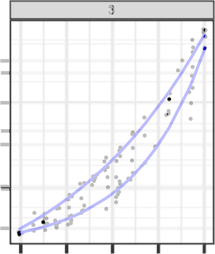

```{r setup2, include = F}
options(width = 60)
knitr::opts_chunk$set(
  echo = F, 
  eval = T, 
  message = F, 
  warning = F,
  fig.width = 6, 
  fig.height = 4,  
  fig.align = 'center',
  out.width = "\\linewidth", 
  dpi = 300, 
  tidy = T, tidy.opts=list(width.cutoff=45),
  fig.pos = "tbp",
  out.extra = "",
  cache = FALSE
)

library(readr)
library(tidyverse)
library(ggtext)
library(scales)
library(knitr)
library(gridExtra)
library(patchwork)
library(cowplot)
library(ggh4x)
library(ggmosaic)
# library(ggforce)
# library(formatR)
```

```{r data}
lineup_model_data <- read_csv("analysis/lineup-model-data.csv") |> 
  mutate(conf_level = factor(conf_level, levels = c("Very Certain", "Certain", "Neutral", "Uncertain", "Very Uncertain"))) |> 
  mutate(conf_level_num = as.numeric(conf_level))
```

\renewcommand{\thesection}{A}
\setcounter{figure}{0}    
\renewcommand\thefigure{\thesection\arabic{figure}}  
\setcounter{equation}{0}    
\renewcommand\theequation{\thesection\arabic{equation}}  


# Exponential growth rates and curvature

Let us consider a simple equation which we could use to simulate data which grows exponentially in $x$, with optional error term $\epsilon$: \begin{align}y &= \exp\{\beta_1 x + \epsilon\}\quad \text{where}\quad \epsilon \sim N(0, \sigma).\label{eq:simpleexp}\end{align}

```{r simple-exponential, echo = F, fig.width = 8, fig.height = 3, out.width = "\\linewidth", fig.cap = "Linear and log scale simple exponential equations as specified in \\cref{eq:simpleexp}, with error term excluded. The y-axis endpoints are a primary visual signal when differentiating between the lines in both plots.", fig.pos = 'hb'}
library(tidyverse)

df <- crossing(tibble(b1 = c(0.06, 0.13, 0.23),
                      eps = c(0.05, 0.12, 0.25)), 
               tibble(x = seq(1, 10, .01))) %>%
  mutate(y = exp(b1*x),
         yvar = exp(b1*x + rnorm(n(), 0, eps))) %>%
  mutate(e0 = paste0("epsilon == ", eps),
         b1 = paste0("beta[1] == ", b1))

logplot <- ggplot(df, aes(x = x, y = y, color = b1)) + 
  geom_line(size = 1) +
  scale_y_continuous(labels = scales::comma) + 
  scale_color_manual("Slope", 
                     labels = expression(beta[1]==0.06, beta[1]==0.13, beta[1]==0.23), 
                     values = c("#1B9E77", "#D95F02", "#7570B3"),
                     guide = guide_legend(reverse = TRUE)) + 
  theme_bw()  + 
  theme(axis.title = element_blank(), 
        axis.text.y = element_text(angle = 90, hjust = .5, vjust = .5),
        legend.position = c(0.01, 0.99), 
        legend.justification = c(0, 1), 
        legend.box = "horizontal")

linearplot <- ggplot(df, aes(x = x, y = y, color = b1)) + 
  geom_line(size = 1) +
  scale_y_log10(labels = scales::comma) + 
  scale_color_manual("Slope", 
                     labels = expression(beta[1]==0.06, beta[1]==0.13, beta[1]==0.23),
                     values = c("#1B9E77", "#D95F02", "#7570B3"),
                     guide = guide_legend(reverse = TRUE)) + 
  theme_bw()  + 
  guides(color = "none") + 
  theme(axis.title = element_blank(), 
        axis.text.y = element_text(angle = 90, hjust = .5, vjust = .5),
        legend.position = c(0.01, 0.99), 
        legend.justification = c(0, 1), 
        legend.box = "horizontal")

logplot + linearplot
```

It is important in lineup studies to control for extraneous visual signals, and when other visual signals creep in, results of the study can be difficult to interpret [@vanderplas_clusters_2017].

In this particular case, the extraneous visual signals are the endpoints of the lines (the endpoint at $x=10$ on a linear scale, and both endpoints on the log scale), as shown in 
\cref{fig:simple-exponential}. 
Preattentive features guide attention [@wolfeWhatPreattentiveFeature2019]; one of the first things we do when scanning a graph is to notice the extent of the data within the axes. 
We must control the endpoints to ensure that participants are using active attention to assess the lineup and draw conclusions, so that the whole visual signal is processed as part of the lineup evaluation; if participants are making decisions off of the endpoints, then we cannot interpret the results to say that they are assessing the rate of exponential growth rather than the end result.

There are several different options for controlling the visual signal in a lineup: 

0. Do nothing and set each subplot's limits to the overall maximum limits.
1. allow each subplot to have different axis limits
2. truncate the displayed range of each subplot to the minimum range generated in the lineup
3. add extra parameters to the exponential equation to adjust the range of the data so that it fits within a pre-specified domain, as in \cref{alg:lineup-exponential-data-simulation-algorithm}.

```{r gen-data-sample, include = F}
set.seed(30204)
param_order <- sample(c(1, rep(2, 19)), size = 20, replace = F)

tmp <- crossing(
  tibble(x = seq(0, 20, length.out = floor(50/3))),
  tibble(plot = 1:20, 
         beta1 = c(0.06, 0.13)[param_order],
         alphatilde = c(37.22, 6.82)[param_order],
         thetahat = c(-27.26, 3.14)[param_order],
         sigma = c(0.05, 0.12)[param_order])
  ) %>%
    group_by(plot) %>%
    sample_n(50, replace = T) %>%
    ungroup() %>%
  mutate(x = jitter(x)) %>%
  mutate(y = exp(beta1*x),
         yvar = exp(beta1*x + rnorm(n(), 0, sigma)),
         yscale = alphatilde*y + thetahat,
         yscalevar = alphatilde * yvar + thetahat) %>%
  arrange(plot, x)

```

```{r lineup-fixed-scales, dpi= 300, fig.width = 7.5, fig.height = 6, out.width = ".6\\linewidth", fig.cap = "When axis limits are fixed to the most expansive extent in the generated data, the primary signal becomes the extent of the domain which has data, rather than the growth rate itself."}
ggplot(tmp, aes(x = x)) + 
  facet_wrap(~plot, ncol = 5, scales = "fixed") + 
  geom_point(aes(y = yvar), size = .05) +
  geom_line(aes(y = y), color = "blue") + 
  theme(aspect.ratio = 1) +
  theme_bw(base_size = 14) +
  theme(axis.title.y = element_blank(),
        axis.title.x = element_blank(),
        axis.text.x = element_blank(),
        axis.text.y = element_blank(),
        strip.text = element_text(size = 5, margin = margin(0.05,0,0.05,0, "cm")),
        strip.background = element_rect(linewidth = 0.5)
  )
```

Typically, lineups do not show axis labels or scaling, because the goal is to assess the signal from the data without additional context. In addition, the traditional 20-panel lineup would be quite visually confusing in this circumstance:

```{r lineup-free-scales, fig.show = 'hold', dpi= 300, fig.width = 7.5, fig.height = 6, out.width = c(".6\\linewidth", ".2\\linewidth"), fig.subcap = c("Lineup", "Overlay of null and signal panels."), fig.cap = "When y-axis limits vary by panel, the y-axis labels are the primary visual signal; the secondary signal (when the panels are overlaid) is the curvature of the line."}

ggplot(tmp, aes(x = x)) + 
  facet_wrap(~plot, ncol = 5, scales = "free") + 
  geom_point(aes(y = yvar), size = .05) +
  geom_line(aes(y = y), color = "blue") + 
  theme(aspect.ratio = 1) +
  theme_bw(base_size = 14) +
  theme(axis.title.y = element_blank(),
        axis.title.x = element_blank(),
        axis.text.x = element_blank(),
        strip.text = element_text(size = 5, margin = margin(0.05,0,0.05,0, "cm")),
        strip.background = element_rect(linewidth = 0.5)
  )


```

\cref{fig:lineup-free-scales} demonstrates that when we ignore the y-axis labels and overlay the signal panel with one of the null panels, the remaining difference is the curvature of the line. 
If we want to keep the standard convention of not including y-axis labels in lineups for simplicity and to reduce plot clutter, this alternative signal seems promising (and as we will show, is approximately equivalent to option 3).

Let us next consider option 2: Crop each panel to the minimum limits of all generated data. The result is shown in \cref{fig:lineup-truncate-scales}. This operation shifts which axis becomes the visually important factor, but doesn't change the problem: previously the issue was the y-axis extent, now it is the x-axis extent. Both of these parameters are implicitly affected by how we generate exponential data. In order to truly assess whether people can discriminate between comparable exponential growth rates graphically, it is more useful to approach the problem from a curvature perspective rather than to artificially limit the data shown.

This issue is a fundamental problem when testing graphics: the test must meet the "goldilocks" standard - not too hard, not too easy, but just right. Both option 0 and option 2 fail this standard.

```{r lineup-truncate-scales, dpi= 300, fig.width = 7.5, fig.height = 6, out.width = ".6\\linewidth", fig.cap = "When axis limits are fixed to the most restrictive in all generated data, the primary signal becomes the extent of the x axis which is covered with data, rather than the growth rate itself."}
lims <- tmp %>% 
  group_by(plot) %>% 
  summarize(xmin = min(x), xmax = max(x), 
            ymin = min(y), ymax = max(y),
            yvarmin = min(c(yvar, y)), yvarmax = max(c(y, yvar))) %>%
  summarize(xmin = max(xmin), xmax = min(xmax),
            ymin = max(ymin), ymax = min(ymax),
            yvarmin = max(yvarmin), yvarmax = min(yvarmax))

ggplot(tmp, aes(x = x)) + 
  facet_wrap(~plot, ncol = 5) + 
  geom_point(aes(y = yvar), size = .05) +
  geom_line(aes(y = y), color = "blue") + 
  coord_cartesian(xlim = c(lims$xmin, lims$xmax),
                  ylim = c(lims$ymin, lims$ymax)) + 
  theme(aspect.ratio = 1) +
  theme_bw(base_size = 14) +
  theme(axis.title.y = element_blank(),
        axis.title.x = element_blank(),
        axis.text.x = element_blank(),
        axis.text.y = element_blank(),
        strip.text = element_text(size = 5, margin = margin(0.05,0,0.05,0, "cm")),
        strip.background = element_rect(linewidth = 0.5)
  )
```


Visually, both the $x$ and $y$ axes matter equally, even if it might on paper make sense to truncate $x$ in order to control the $y$ axis range. 

An additional benefit of controlling endpoints is that it also provides some realism: our goal was to assess the ability to examine exponential growth **rates**, motivated by the COVID-19 pandemic. As each geographic reporting region started with different numbers of cases and had different control policies, the $\alpha$ and $\theta$ parameters are reasonable to represent some of these differences while still examining the underlying exponential behavior. 

To control these endpoints on both scales then we have to move to an exponential model that is a bit more complicated: 
\begin{align}y = \alpha \cdot \exp\left\{\beta_1 x + \epsilon\right\} + \theta\quad \text{where}\quad \epsilon \sim N(0, \sigma).\label{eq:complexexp}\end{align}

$\alpha$ and $\theta$ were used to make endpoints consistent among the growth rates. As a result, the lineups examine the degree of inflection of the trend rather than the explicit exponential growth rate. An explanation for how the ultimate values for $\alpha$ and $\theta$ were determined is provided in  \cref{alg:lineup-exponential-data-simulation-algorithm}. \cref{fig:lineup-scale-data} uses the parameters  in \cref{tab:parameter-data} and the data generating method described in \cref{alg:lineup-exponential-data-simulation-algorithm}. The result is a series of panels which have obvious variation due to the points (a desirable feature) but where the underlying relationship shown in blue has consistent endpoints. As a result, the question becomes whether participants can identify that plot 3 has a different growth rate (as measured by the curvature of the line). 

```{r lineup-scale-data, dpi= 300, fig.width = 7.5, fig.height = 6, out.width = ".6\\linewidth", fig.cap = "When the data are scaled such that endpoints are similar across all conditions, the primary feature becomes the curvature of the line, while individual plots show random variation due to the scatter around the line."}
ggplot(tmp, aes(x = x)) + 
  facet_wrap(~plot, ncol = 5) + 
  geom_point(aes(y = yscalevar), size = .05) +
  geom_line(aes(y = yscale), color = "blue") + 
  theme(aspect.ratio = 1) +
  theme_bw(base_size = 14) +
  theme(axis.title.y = element_blank(),
        axis.title.x = element_blank(),
        axis.text.x = element_blank(),
        axis.text.y = element_blank(),
        strip.text = element_text(size = 5, margin = margin(0.05,0,0.05,0, "cm")),
        strip.background = element_rect(linewidth = 0.5)
  )
```

# Participant self-percieved confidence and accuracy

In addition to investigating how scale and curvature rate influence participant accuracy, we asked participants to indicate their level of confidence on a five-point likert scale by answering, "How certain are you?" \cref{fig:conf-mosaic} shows the observed confidence rating proportions for correct and incorrect identifications across the different scale and curvature combination scenarios. Overall, participants who correctly identified the target plot were more confident in their plot choice across all conditions with the highest confidence levels and accuracy in scenarios with large differences in curvature between the target and null panels. 

```{r conf-mosaic, fig.width=12, fig.height=8}

# labellers for plotting
target_level <- c(
  "H" = "Low Target Curvature",
  "M" = "Moderate Target Curvature",
  "E" = "High Target Curvature"
)

null_level <- c(
  "H" = "Low Null Curvature",
  "M" = "Moderate Null Curvature",
  "E" = "High Null Curvature"
)

scale_level <- c("linear" = "Linear Scale",
                 "log" = "Log Scale")

# confidence mosaic plot
lineup_model_data |> 
  mutate(target = factor(target, levels = c("H", "M", "E")),
         null = factor(null, levels = c("H", "M", "E")),
         conf_level = factor(conf_level, levels = c("Very Uncertain", "Uncertain", "Neutral", "Certain", "Very Certain")),
         binary_response = factor(binary_response, levels = c(1,0), labels = c("Correct", "Incorrect"))
         ) |>
  ggplot() +
  geom_mosaic(aes(x = product(binary_response),
             fill = conf_level),
             show.legend = T,
             color = "black") +
  facet_nested(null ~ scale + target,
               # labeller = label_both
             labeller = labeller(scale = scale_level,
                                 null = null_level,
                                 target = target_level)
             ) +
  scale_fill_brewer(palette = "PuOr",
                    guide = guide_legend(reverse = TRUE)) +
  labs(y = "",
       x = "Evaluation",
       fill = "How certain are you?") +
  theme_test() +
  theme(axis.text.y = element_blank(),
        axis.ticks.y = element_blank())
```

