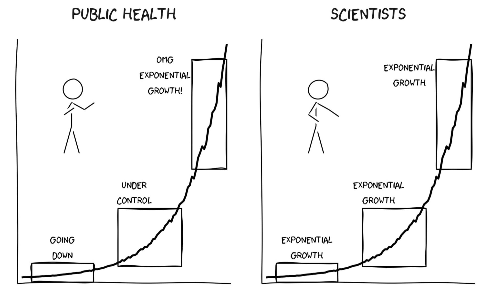
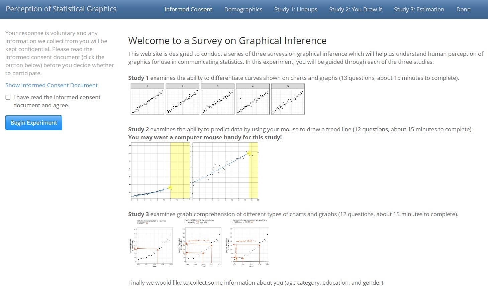
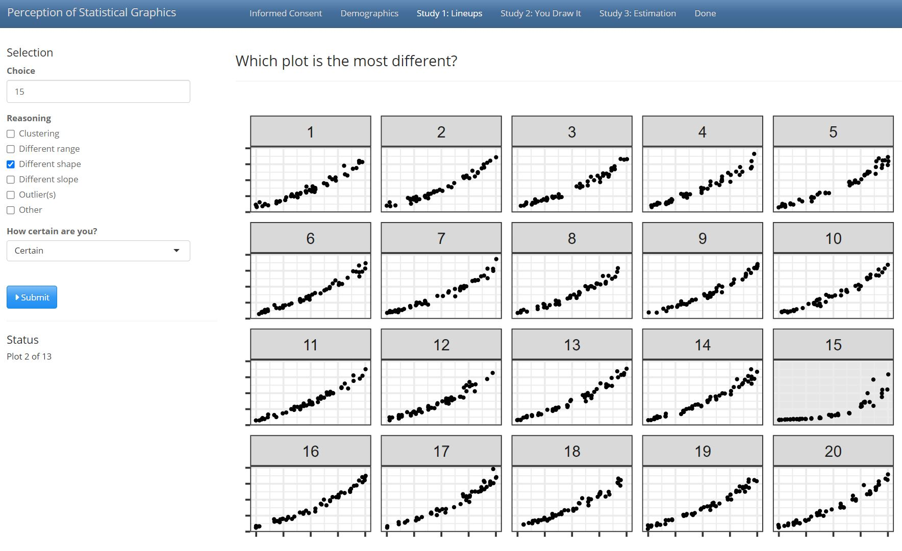
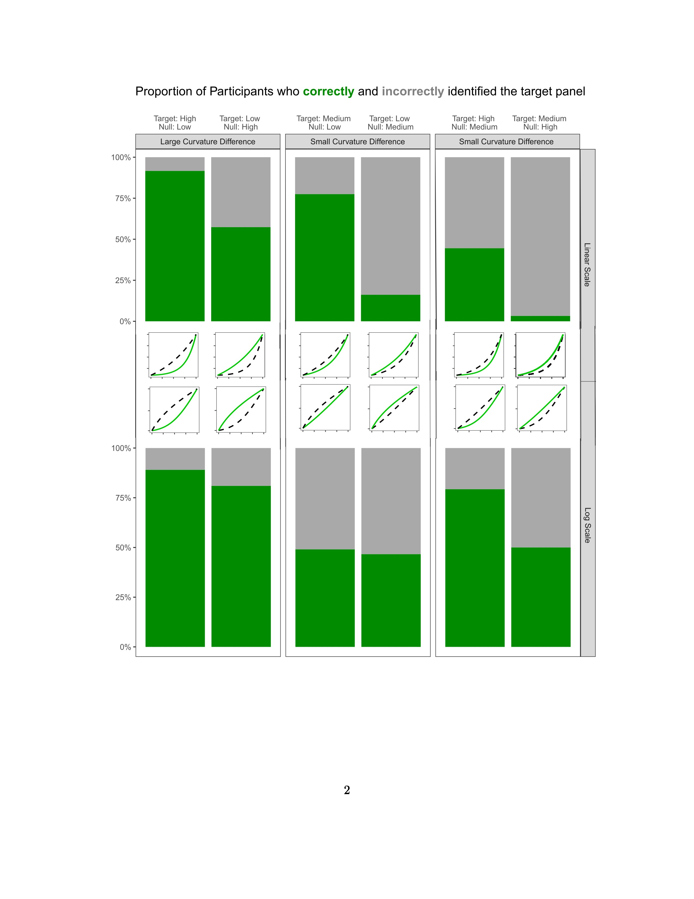

```{r setup, include = F}
options(width = 60)
knitr::opts_chunk$set(
  echo = F, 
  eval = T, 
  message = F, 
  warning = F,
  fig.width = 6, 
  fig.height = 4,  
  fig.align = 'center',
  out.width = "\\linewidth", 
  dpi = 300, 
  tidy = T, tidy.opts=list(width.cutoff=45),
  fig.pos = "tbp",
  out.extra = "",
  cache = FALSE
)

library(readr)
library(tidyverse)
library(ggtext)
library(scales)
library(knitr)
library(gridExtra)
library(patchwork)
library(cowplot)
# library(ggforce)
# library(formatR)
```

# Introduction

Effective communication of data is critical in influencing people's opinions and actions. 
This consideration was particularly true during the COVID-19 pandemic, where data visualizations and dashboards were vital in informing the public and policymakers about the outbreak's status.
Local governments relied on graphics to inform their decisions about shutdowns and mask mandates, while residents were presented with data visualizations to encourage compliance with these regulations.
A major issue designers encountered when creating COVID-19 plots was how to display data from a wide range of values [@fagen-ulmschneider_2020, @burnmurdoch_2020].
When faced with data that span several orders of magnitude, we must decide whether to show the data on its original scale (compressing the smaller magnitudes into a relatively small area) or to transform the scale and alter the contextual appearance of the data. 
Log axis transformations have emerged as a standard solution to this challenge, as they allow for the display of data over several orders of magnitude within a single graph.

Exponential data is one such example of a function that compresses smaller magnitudes into a smaller area; \cref{fig:log-scales} presents hard drive capacity over the past forty years on both the linear and log scales to demonstrate the usefulness of log scales when dealing with data spanning multiple magnitudes.
Logarithms facilitate the conversion of multiplicative relationships (displaying 1 & 10 with a distance of 10 units apart and displaying 10 & 100 with a distance of 90 units apart) to additive relationships (displaying 1 & 10 and 10 & 100 an equal distance apart), highlighting proportional relationships and linearizing power functions [@menge_logarithmic_2018]. 
Logarithms also have practical applications, simplifying the computation of small numbers such as likelihoods and transforming data to conform to statistical assumptions.
Although log scales have a long history of use in fields such as ecology, psychophysics, engineering, and physics [@heckler_student_2013; @waddell2005comparisons], there is still a need to understand the implications of their use and provide best practices for their implementation.

```{r log-scales, fig.cap = "These plots present hard drive capacity over the past forty years on both the linear and log scale and illustrate the use of the log scale when displaying data which spans several magnitudes.", out.width="100%"}

# data <- tibble(x = seq(0,10, by = 0.1), y = exp(x))

mem_data <- read_csv("data/computer-memory-data.csv")

linear_scale <- mem_data |>
  filter(type == "Hard Drive Capacity") |> 
  ggplot(aes(x = dec_date, y = value)) +
  geom_point(shape = 1, alpha = 0.6) +
  theme_bw() +
  theme(aspect.ratio = 1) +
  ggtitle("Linear Scale") +
  labs(x = "Year",
       y = "",
       subtitle = "Hard Drive Capacity")

log_scale <- mem_data |>
  filter(type == "Hard Drive Capacity") |> 
  ggplot(aes(x = dec_date, y = value)) +
  geom_point(shape = 1, alpha = 0.6) +
  theme_bw() +
  theme(aspect.ratio = 1) +
  scale_y_log10(breaks = trans_breaks("log10", function(x) 10^x),
                labels = scales::comma) +
  ggtitle("Log Scale") +
  labs(x = "Year",
       y = "",
       subtitle = "Hard Drive Capacity")

linear_scale + log_scale
```

Apart from the biases resulting from using log scales, there is a general misinterpretation of exponential growth. Early stages of exponential growth often appear to have a small growth rate, while the middle stage seems to exhibit more quadratic growth. It is only in the later stages that the exponential growth becomes apparent. \cref{fig:exponential-stages} highlights the three stages and associated appearances of exponential growth at each stage [@vonbergmann_2021]. 
This misinterpretation can lead to decisions made under inaccurate understanding, resulting in potential consequences.

```{r exponential-stages, fig.cap = "This figure highlights the three stages and associated appearances of exponential growth at each stage. Early stages of exponential growth often appear to have a small growth rate, while the middle stage seems to exhibit more quadratic growth. It is only in the later stages that the exponential growth becomes apparent.", out.width="100%"}

```

```{r exponential-stages-v2, include = FALSE, fig.cap = "Highlights the three stages and associated appearances of exponential growth at each stage. Early stages of exponential growth often appear to have a small growth rate, while the middle stage seems to exhibit more quadratic growth. It is only in the later stages that the exponential growth becomes apparent.", out.width="100%"}
library(ggforce)

data <- tibble(x = seq(0,6,0.001),
               y = exp(x)) %>%
  mutate(group = ifelse(x <= 2, "G1", 
                        ifelse(x <= 4, "G2", "G3")))

data |> 
  ggplot(aes(x = x, y = y, color = group)) +
  geom_line(show.legend = T, linewidth = 1.2) +
  theme_bw() +
  theme(aspect.ratio = 1) +
  # facet_zoom(xlim = c(0,2), shrink = F, zoom.size = 3) +
  # facet_zoom(xy = group == 'G1', zoom.size = 1/3) +
  geom_mark_rect(show.legend = T) +
  geom_text(x = 0.8, y = 50, label = "Early", color = "#1B9E77", size = 4) +
  geom_text(x = 2.8, y = 100, label = "Middle", color = "#D95F02", size = 4) +
  geom_text(x = 4.8, y = 300, label = "Late", color = "#7570B3", size = 4) +
  scale_color_brewer("Stage", palette = "Dark2", labels = c("Early", "Middle", "Late")) +
  labs(x = "",
       y = "",
       title = "Stages of Exponential Growth") +
  theme(axis.text = element_blank(),
        legend.position = "none"
        )
```

Previous studies have explored the estimation and prediction of exponential growth and found that individuals often underestimate exponential growth when presented values numerically and graphically [@wagenaar_misperception_1975]. The hierarchy of plot objects, such as lengths and angles, as described by @cleveland_graphical_1985, offers a possible explanation for the underestimation observed in exponentially increasing trends. Experiments conducted by @wagenaar_misperception_1975, @jones_polynomial_1977, and @mackinnon_feedback_1991 aimed to improve estimation accuracy for exponential growth. While contextual knowledge or experience did not enhance estimation, instruction on exponential growth reduced underestimation by prompting participants to adjust their initial starting value [@wagenaar_misperception_1975; @jones_polynomial_1977]. Furthermore, providing immediate feedback to participants about the accuracy of their predictions improved estimation [@mackinnon_feedback_1991].

Log transforming the data may address our inability to predict exponential growth accurately. However, this transformation introduces new complexities, as most readers may need to be mathematically sophisticated enough to intuitively understand logarithmic math and translate it back into real-world effects.
Despite the transformative power of logarithmic scales in facilitating accurate data representation, @menge_logarithmic_2018's survey of ecologists highlights the challenges associated with the widespread comprehension of log-scaled data. Notably, the study identifies prevalent misconceptions arising from linear extrapolation assumptions in log-log space, a factor that often leads to neglect of the underlying exponential relationships in linear-linear space.

Building upon the need for a nuanced understanding of data representation, @buja_statistical_2009 introduced statistical lineups as a framework for statistical inference and graphical tests.
Statistical lineups treat a data plot as a visual statistic, summarizing the data as a numerical function or mapping.
Evaluation of a panel in a statistical lineup requires visual inspection by a person, and if visual evaluations lead to different results, two visualization methods are deemed significantly different.
Recent studies have utilized statistical lineups to quantify the perception of graphical design choices [@hofmann_graphical_2012; @loy_model_2017; @loy_variations_2016; @vanderplas_clusters_2017]. 
Statistical lineups provide an elegant way of combining perception and statistical hypothesis testing through graphical experiments [@majumder_validation_2013; @vanderplas_testing_2020; @wickham2010graphical].

The term 'lineup' is an analogy to police lineups in criminal investigations, where witnesses identify the criminal from a group of individuals. 
Similarly, researchers present a statistical lineup plot consisting of smaller panels and ask the viewer to identify the panel that contains the actual data from a set of decoy null plots. 
Researchers generate null plots containing data generated according to a prespecified hypothesis using permutation or simulation.
Typically, a statistical lineup consists of 20 panels, with one target panel and 19 null panels.
If the viewer can identify the target panel from the null panels, it suggests that the actual data is visually distinct from the data generated under the null model. 

While explicit graphical tests direct the participant to a specific feature of a plot to answer a particular question, implicit graphical tests require the user to identify both the purpose and function of the plot in order to evaluate the plots shown. 
Furthermore, implicit graphical tests, such as lineups, simultaneously test for multiple visual features, including outliers, clusters, and linear and nonlinear relationships [@vanderplas2015spatial].
Researchers can collect responses from multiple viewers using crowd-sourcing websites such as Prolific and Amazon Mechanical Turk.

In this paper, our primary focus is to evaluate the benefits and drawbacks of using log scales, specifically delving into their impact on perceptual sensitivity towards the degree of curvature. To address this, we conducted a visual inference experiment employing statistical lineups [@buja_statistical_2009]. Although our findings could have broad applications to various functions resulting in curvature, our experiment deliberately centered on participants' ability to identify differences in the curvature of exponentially increasing curves when presented with both linear and log scales. We discuss the nuances and challenges of testing the perception of exponential growth in the appendix. Importantly, this investigation did not necessitate participants to undergo mathematical training or possess a prior understanding of exponential growth or logarithmic scales. Instead, it aimed to unravel the inherent ability to identify differences in curvature within charts, focusing on the fundamental nature of visual perception.

In [Section 2](#methods) we describe the participant sample, the graphical task, data generation process, and study design.
[Section 3](#results) describes the participant data collected and shares results from the statistical analyses of the data using a generalized linear mixed model.
We present overall conclusions and discussion of the results in [Section 4](#conclusion-discussion), and provide an overview of future related papers.
The [Supplementary Material](#supplementary-material) includes a link to the RShiny data collection applet, participant data used for analysis, and code to replicate the analysis.
The results of this study lay the groundwork for further exploration of the implications of using log scales in data visualization.

# Study Development and Methods {#methods}

[@Rstudio]

## Data Generation

In this study, we simulated data from an exponential model to generate the target and null data sets; the models between panels differ in the parameter values selected for the null and target panels.
In order to guarantee the simulated data spans the same domain and range of values for each statistical lineup panel, we began with a domain constraint of $x\in [0,20]$ and a range constraint of $y\in [10,100]$ with $N = 50$ points randomly assigned throughout the domain. We mapped the randomly generated $x$ values to a corresponding $y$ value based on an exponential model with predetermined parameter values and multiplicative random errors to simulate the response.
These constraints assure that participants who select the target panel are doing so because of their visual perception differentiating between curvature or growth rate rather than different starting or ending values.

We simulated data based on a three-parameter exponential model with multiplicative errors: 
\begin{align}
y_i & = \alpha\cdot e^{\beta\cdot x_i + \epsilon_i} + \theta \\
\text{with } \epsilon_i & \sim N(0, \sigma^2). \nonumber
\end{align} 
The parameters $\alpha$ and $\theta$ were adjusted based on $\beta$ and $\sigma^2$ to guarantee the range and domain constraints are met. 
The model generated $N = 50$ points $(x_i, y_i), i = 1,...,N$ where $x$ and $y$ have an increasing exponential relationship. 
The heuristic data generation procedure is described in \cref{alg:lineup-parameter-estimation-algorithm} and \cref{alg:lineup-exponential-data-simulation-algorithm}.

\begin{algorithm}
  \caption{Lineup Parameter Estimation}\label{alg:lineup-parameter-estimation-algorithm}
  \begin{algorithmic}[1]
    \Statex \hspace*{-1em}\textbullet~\textbf{Input Parameters:} domain $x\in[0,20]$, range $y\in[10,100]$, midpoint $x_{mid}$.
    \Statex \hspace*{-1em}\textbullet~\textbf{Output Parameters:} estimated model parameters $\hat\alpha, \hat\beta, \hat\theta$.
    \State In order to obtain the two middle points (total of four points for estimating three parameters), determine the $y=-x$ line scaled to fit the assigned domain and range.
    \State Map the values $x_{mid} - 0.1$ and $x_{mid} + 0.1$ to the $y=-x$ line for the two additional points.
    \State From the set of points $(x_k, y_k)$ for $k = 1,2,3,4$, calculate the coefficients from the linear regression model $\ln(y_k) = b_0 +b_1x_k$ to obtain starting values for $\alpha_0 = e^{b_0}, \beta_0 =  b_1, \theta_0 = 0.5\cdot \min(y)$
    \State Using the \texttt{nls} function from the base \texttt{stats} package in Rstudio [@Rstudio] and the starting parameter values - $\alpha_0, \beta_0, \theta_0$ - fit the nonlinear model, $y_k = \alpha\cdot e^{\beta\cdot x_k}+\theta$ to get estimated parameter values for $\hat\alpha, \hat\beta, \hat\theta.$
  \end{algorithmic}
\end{algorithm}

\begin{algorithm}
  \caption{Lineup Exponential Data Simulation}\label{alg:lineup-exponential-data-simulation-algorithm}
  \begin{algorithmic}[1]
    \Statex \hspace*{-1em}\textbullet~\textbf{Input Parameters:} sample size $N = 50$, estimated parameters $\hat\alpha$, $\hat\beta$, and $\hat\theta$, from \cref{alg:lineup-parameter-estimation-algorithm}, and standard deviation $\sigma$ from the exponential curve.
    \Statex \hspace*{-1em}\textbullet~\textbf{Output Parameters:} $N$ points, in the form of vectors $\mathbf{x}$ and $\mathbf{y}$.
    \State Generate $\tilde x_j, j = 1,..., \frac{3}{4}N$ as a sequence of evenly spaced points in $[0,20]$. This ensures the full domain of $x$ is used, fulfilling the constraints of spanning the same domain and range for each parameter combination.
    \State Obtain $\tilde x_i, i = 1,...,N$ by sampling $N = 50$ values from the set of $\tilde x_j$ values. This guarantees some variability and potential clustering in the exponential growth curve disrupting the perception due to continuity of points.
    \State Obtain the final $x_i$ values by jittering $\tilde x_i$.
    \State Calculate $\tilde\alpha = \frac{\hat\alpha}{e^{\sigma^2/2}}.$ This ensures that the range of simulated values for different standard deviation parameters has an equal expected value for a given rate of change due to the non-constant variance across the domain.
    \State Generate $y_i = \tilde\alpha\cdot e^{\hat\beta x_i + e_i}+\hat\theta$ where $e_i\sim N(0,\sigma^2).$
  \end{algorithmic}
\end{algorithm}

## Parameter Selection {#lineups-parameter-selection}

We chose three levels of trend curvature (low curvature, medium curvature, and high curvature). For each curvature level, we simulated 1,000 data sets of $(x_{ij}, y_{ij})$ points for $i = 1,...,50$ increments of $x$-values and replicated $j = 1,...,10$ corresponding $y$-values per $x$-value.
Each generated $x_i$ point from \cref{alg:lineup-exponential-data-simulation-algorithm} was replicated ten times. 
We fit a linear regression model on each of the individual data sets and computed the lack of fit statistic (LOF) which measures the deviation of the data from the linear regression model.
After obtaining the LOF statistic for each level of curvature, we evaluated the density plots \pcref{fig:lof-density-curves} to provide a metric for differentiating between the curvature levels and thus detecting the target plot.
While the LOF statistic provides a numerical value for discriminating between the difficulty levels, it cannot be directly related to the perceptual discriminability; it serves primarily as an approximation to ensure that we are testing parameters at several distinct curvature levels.
\cref{tab:parameter-data} lists the final parameters used for data simulation.

```{r lof-density-curves, fig.height = 4, fig.width = 8, fig.cap = "Density plot of the lack of fit statistic showing separation of difficulty levels: obvious curvature, noticable curvature, and almost linear.", out.width = "100%"}
lofData <- read.csv(file = "data/lineup-lof-data.csv")

lofPlot_curvature <- lofData |>
  mutate(Curvature = factor(Curvature, 
                            levels = c("Obvious Curvature", 
                                       "Noticeable Curvature", 
                                       "Almost Linear"
                                       ),
                            labels = c("High Curvature", 
                                      "Medium Curvature", 
                                      "Low Curvature")
                            ),
         Variability = factor(Variability, levels = c("Low"))
         ) |>
  ggplot(aes(x = statistic, 
             fill = Curvature)
         ) +
  geom_density(alpha = 0.6, aes(color = Curvature)) +
  scale_fill_manual("Difficulty", values = c("#004400", "#116611", "#55aa55")) +
  scale_color_manual("Difficulty", values = c("#004400", "#116611", "#55aa55")) +
  theme_bw(base_size = 14) +
  theme(legend.position = "none",
        axis.text.x  = element_text(size = 12),
        axis.text.y  = element_blank(),
        axis.ticks.y = element_blank(),
        plot.title   = element_markdown(size = 14,
                                    lineheight = 1.2),
        panel.grid.minor = element_blank()
        ) +
  scale_x_continuous("", limits = c(0,800), breaks = seq(0,800,100), expand = c(0.01,0.01)) +
  scale_y_continuous("", limits = c(0, 0.025)) +
  labs(title = "Comparison of Densities for the Lack of Fit Statistic <br> between <span style = 'color:#004400'>**High**</span>, <span style = 'color:#116611'>**Medium**</span>, and <span style = 'color:#55aa55'>**Low**</span> Curvature Levels"
        )
lofPlot_curvature
```

```{r parameter-data}
parameter_data <- read.csv(file = "data/lineup-parameter-data.csv")
parameter_data |>
  mutate(difficulty = case_when(difficulty == "Obvious Curvature" ~ "High",
                                difficulty == "Noticable Curvature" ~ "Medium",
                                difficulty == "Almost Linear" ~ "Low"
                                )
         ) |>
  select(difficulty, xMid, alphahat, alphatilde, betahat, thetahat, sigma_vals) |>
  knitr::kable("latex", 
               digits = 2, 
               escape = F, 
               booktabs = T, 
               linesep = "", 
               align='lrrrrrr',
               label = "parameter-data",
               col.names = c("Curvature Level",   
                             "$x_{mid}$", 
                             "$\\hat\\alpha$", 
                             "$\\tilde\\alpha$", 
                             "$\\hat\\beta$",
                             "$\\hat\\theta$", 
                             "$\\hat\\sigma$"
                             ),
        caption = "Lineup data simulation final parameters"
        )
```

## Lineup Setup 

To generate the small multiple scatter plots for the statistical lineups shown to participants in the study, we simulated a single data set corresponding to curvature level A for the target plot and multiple data sets corresponding to curvature level B for the null plots.
The `nullabor` package in R [@buja_statistical_2009] randomly assigned the target plot to one of the panels surrounded by panels containing null plots.
<!-- For example, the statistical lineup randomly embeds a target plot with simulated data following an increasing exponential curve with high curvature within null plots with simulated data following an increasing exponential trend with low curvature.  -->
The target and null panels span a similar domain and range due to the implemented constraints when simulating the data; the rationale for this decision is based on preattentive feature perception [@wolfeWhatPreattentiveFeature2019] and is discussed in detail in the appendix. 
There were a total of six lineup curvature combinations; \cref{fig:curvature-combination-example} illustrates the six lineup curvature combinations (top: linear scale; bottom: log scale) where the solid line indicates the curvature level designated to the target plot while the dashed line indicates the curvature level assigned to the null plots.
Two sets of each lineup curvature combination were simulated (a total of twelve test data sets) and plotted on both the linear scale and the log scale (24 test lineup plots).
In addition, three curvature combinations generated homogeneous "Rorschach" lineups, where all panels were from the same distribution.
Each participant evaluated one "Rorschach" lineup. Results from the "Rorschach" evaluations indicate null panel selections were distributed relatively evenly with multiple candidates for the most interesting panel. We display and further discuss the "Rorschach" evaluation results in the appendix.

```{r curvature-combination-example, fig.height = 6, fig.width = 9, fig.cap = "Thumbnail plots illustrating the six curvature combinations displayed on both scales (linear and log). The solid line indicates the curvature level to be identified as the target plot from amongst a set of null plots with the curvature level indicated by the dashed line.", out.width="100%"}
simData <- read.csv("data/difficulty-comparison-data.csv")

# simData  |>
#   mutate(curvature = factor(curvature, levels = c("E", "M", "H"), labels = c("High Curvature", "Medium Curvature", "Low Curvature"))) |>
#   ggplot(aes(x = x, y = y, color = curvature)) +
#   geom_line(size = 1) +
#   theme_bw() +
#   theme(aspect.ratio = 1) +
#   theme(axis.text = element_blank(),
#         axis.title = element_blank(),
#         legend.position = "bottom") +
#   scale_color_manual("Difficulty", values = c("#004400", "#116611", "#55aa55"))

tE_nM <- simData  |>
  mutate(Target = "High",
         Null = "Medium") |>
  filter(curvature %in% c("E", "M")) |>
  mutate(curvature = factor(curvature, levels = c("E", "M", "H"))) |>
  ggplot(aes(x = x, y = y, color = curvature, linetype = curvature)) +
  geom_line(linewidth = 1) +
  theme_test() +
  theme(aspect.ratio = 1) +
  theme(axis.text = element_blank(),
        axis.title = element_blank(),
        legend.position = "none") +
  scale_x_continuous(limits = c(0,20)) +
  scale_color_manual(values = c("green3", "black")) +
  scale_linetype_manual(values = c("solid", "dashed"))

tE_nH <- simData  |>
  mutate(Target = "High",
         Null = "Low") |>
  filter(curvature %in% c("E", "H")) |>
  mutate(curvature = factor(curvature, levels = c("E", "M", "H"))) |>
  ggplot(aes(x = x, y = y, color = curvature, linetype = curvature)) +
  geom_line(linewidth = 1) +
  theme_test() +
  theme(aspect.ratio = 1) +
  theme(axis.text = element_blank(),
        axis.title = element_blank(),
        legend.position = "none") +
  scale_x_continuous(limits = c(0,20)) +
  scale_color_manual(values = c("green3", "black")) +
  scale_linetype_manual(values = c("solid", "dashed"))

tM_nE <- simData  |>
  mutate(Target = "Medium",
         Null = "High") |>
  filter(curvature %in% c("E", "M")) |>
  mutate(curvature = factor(curvature, levels = c("E", "M", "H"))) |>
  ggplot(aes(x = x, y = y, color = curvature, linetype = curvature)) +
  geom_line(linewidth = 1) +
  theme_test() +
  theme(aspect.ratio = 1) +
  theme(axis.text = element_blank(),
        axis.title = element_blank(),
        legend.position = "none") +
  scale_x_continuous(limits = c(0,20)) +
  scale_color_manual(values = c("black", "green3")) +
  scale_linetype_manual(values = c("dashed", "solid"))

tM_nH <- simData  |>
  mutate(Target = "Medium",
         Null = "Low") |>
  filter(curvature %in% c("H", "M")) |>
  mutate(curvature = factor(curvature, levels = c("E", "M", "H"))) |>
  ggplot(aes(x = x, y = y, color = curvature, linetype = curvature)) +
  geom_line(linewidth = 1) +
  theme_test() +
  theme(aspect.ratio = 1) +
  theme(axis.text = element_blank(),
        axis.title = element_blank(),
        legend.position = "none") +
  scale_x_continuous(limits = c(0,20)) +
  scale_color_manual(values = c("green3", "black")) +
  scale_linetype_manual(values = c("solid", "dashed"))

tH_nE <- simData  |>
  mutate(Target = "Low",
         Null = "High") |>
  filter(curvature %in% c("E", "H")) |>
  mutate(curvature = factor(curvature, levels = c("E", "M", "H"))) |>
  ggplot(aes(x = x, y = y, color = curvature, linetype = curvature)) +
  geom_line(linewidth = 1) +
  theme_test() +
  theme(aspect.ratio = 1) +
  theme(axis.text = element_blank(),
        axis.title = element_blank(),
        legend.position = "none") +
  scale_x_continuous(limits = c(0,20)) +
  scale_color_manual(values = c("black", "green3")) +
  scale_linetype_manual(values = c("dashed", "solid"))

tH_nM <- simData  |>
  mutate(Target = "Low",
         Null = "Medium") |>
  filter(curvature %in% c("H", "M")) |>
  mutate(curvature = factor(curvature, levels = c("E", "M", "H"))) |>
  ggplot(aes(x = x, y = y, color = curvature, linetype = curvature)) +
  geom_line(linewidth = 1) +
  theme_test() +
  theme(aspect.ratio = 1) +
  theme(axis.text = element_blank(),
        axis.title = element_blank(),
        legend.position = "none") +
  scale_x_continuous(limits = c(0,20)) +
  scale_color_manual(values = c("black", "green3")) +
  scale_linetype_manual(values = c("dashed", "solid"))

# linear scale

tE_nH_linear <- tE_nH +
  scale_y_continuous(limits = c(10,100))

tE_nM_linear <- tE_nM +
  scale_y_continuous(limits = c(10,100))

tM_nH_linear <- tM_nH +
  scale_y_continuous(limits = c(10,100))

tM_nE_linear <- tM_nE +
  scale_y_continuous(limits = c(10,100))

tH_nM_linear <- tH_nM +
  scale_y_continuous(limits = c(10,100))

tH_nE_linear <- tH_nE +
  scale_y_continuous(limits = c(10,100))

# log scale

library(scales)

tE_nH_log <- tE_nH +
  scale_y_continuous(limits = c(10,100), trans = "log10")

tE_nM_log <- tE_nM +
  scale_y_continuous(limits = c(10,100), trans = "log10")

tM_nH_log <- tM_nH +
  scale_y_continuous(limits = c(10,100), trans = "log10")

tM_nE_log <- tM_nE +
  scale_y_continuous(limits = c(10,100), trans = "log10")

tH_nM_log <- tH_nM +
  scale_y_continuous(limits = c(10,100), trans = "log10")

tH_nE_log <- tH_nE +
  scale_y_continuous(limits = c(10,100), trans = "log10")


# output plots with patchwork

# target high null low
tE_nH_linear +
  ggtitle("Linear Scale") +
  facet_grid(~ Target + Null, labeller = labeller(Target = label_both, Null = label_both)) +

# target low null high
tH_nE_linear +
  facet_grid(~ Target + Null, labeller = labeller(Target = label_both, Null = label_both)) +

# target medium null low
tM_nH_linear +
  facet_grid(~ Target + Null, labeller = labeller(Target = label_both, Null = label_both)) +

# target low null medium
tH_nM_linear +
  facet_grid(~ Target + Null, labeller = labeller(Target = label_both, Null = label_both)) +
  
# target high null medium
tE_nM_linear +
  facet_grid(~ Target + Null, labeller = labeller(Target = label_both, Null = label_both)) +
  
# target medium null high
tM_nE_linear +
  facet_grid(~ Target + Null, labeller = labeller(Target = label_both, Null = label_both)) +


  
  
# target high null low
tE_nH_log +
  ggtitle("Log Scale") +
  facet_grid(~ Target + Null, labeller = labeller(Target = label_both, Null = label_both)) +

# target low null high
tH_nE_log +
  facet_grid(~ Target + Null, labeller = labeller(Target = label_both, Null = label_both)) +
  
# target medium null low
tM_nH_log +
  facet_grid(~ Target + Null, labeller = labeller(Target = label_both, Null = label_both)) +

# target low null medium
tH_nM_log +
  facet_grid(~ Target + Null, labeller = labeller(Target = label_both, Null = label_both)) +
  
# target high null medium
tE_nM_log +
  facet_grid(~ Target + Null, labeller = labeller(Target = label_both, Null = label_both)) +

  # target medium null high
tM_nE_log +
  facet_grid(~ Target + Null, labeller = labeller(Target = label_both, Null = label_both)) +
  
plot_layout(ncol = 6) 

# save thumbnails for plotting later

# tM_nH_thumbnail <- ((tM_nH_linear + ggtitle("Linear") + theme(plot.title = element_text(size = 70))) + (tM_nH_log+ ggtitle("Log"))) + theme(plot.title = element_text(size = 70))
# ggsave(tM_nH_thumbnail, file = "images/tM_nH_thumbnail-title.png", width = 6, height = 4)
# 
# tE_nH_thumbnail <- tE_nH_linear + tE_nH_log
# ggsave(tE_nH_thumbnail, file = "images/tE_nH_thumbnail.png", width = 6, height = 3)
# 
# tH_nM_thumbnail <- tH_nM_linear + tH_nM_log
# ggsave(tH_nM_thumbnail, file = "images/tH_nM_thumbnail.png", width = 6, height = 3)
# 
# tE_nM_thumbnail <- tE_nM_linear + tE_nM_log
# ggsave(tE_nM_thumbnail, file = "images/tE_nM_thumbnail.png", width = 6, height = 3)
# 
# tH_nE_thumbnail <- tH_nE_linear + tH_nE_log
# ggsave(tH_nE_thumbnail, file = "images/tH_nE_thumbnail.png", width = 6, height = 3)
# 
# tM_nE_thumbnail <- tM_nE_linear + tM_nE_log
# ggsave(tM_nE_thumbnail, file = "images/tM_nE_thumbnail.png", width = 6, height = 3)

# individual linear
# 
# ggsave(tM_nH_linear, file = "images/tM_nH_linear.png", width = 6, height = 6)
# ggsave(tE_nH_linear, file = "images/tE_nH_linear.png", width = 6, height = 6)
# ggsave(tH_nM_linear, file = "images/tH_nM_linear.png", width = 6, height = 6)
# ggsave(tE_nM_linear, file = "images/tE_nM_linear.png", width = 6, height = 6)
# ggsave(tH_nE_linear, file = "images/tH_nE_linear.png", width = 6, height = 6)
# ggsave(tM_nE_linear, file = "images/tM_nE_linear.png", width = 6, height = 6)
# 
# # individual log
# ggsave(tM_nH_log, file = "images/tM_nH_log.png", width = 6, height = 6)
# ggsave(tE_nH_log, file = "images/tE_nH_log.png", width = 6, height = 6)
# ggsave(tH_nM_log, file = "images/tH_nM_log.png", width = 6, height = 6)
# ggsave(tE_nM_log, file = "images/tE_nM_log.png", width = 6, height = 6)
# ggsave(tH_nE_log, file = "images/tH_nE_log.png", width = 6, height = 6)
# ggsave(tM_nE_log, file = "images/tM_nE_log.png", width = 6, height = 6)
```

\cref{fig:lineup-example} presents examples of statistical lineups with the target data simulated with exponential parameters corresponding high curvature and the surrounding null panels simulated with parameters for low curvature.
The statistical lineup on the left presents increasing exponential data with displayed on a linear scale with panel \ear{13} as the target panel.
The lineup on the right shows increasing exponential data plotted on a log scale with panel \ear{4} as the target panel.

```{r lineup-example, fig.height = 2.75, fig.width = 5.75, fig.cap = "The lineup plot on the left displays increasing exponential data on a linear scale with panel (13 as the target. The lineup plot on the right displays increasing exponential data on the log scale with panel 4 as the target."}

lineupData_linear <- read.csv(file = "data/lineup-example-data-linear.csv")

linearPlot <- ggplot(lineupData_linear, aes(x=x, y=y)) +
  facet_wrap(~.sample, ncol=5) +
  geom_point(size = .05) +
  theme(aspect.ratio = 1) +
  theme_bw(base_size = 14) +
  theme(axis.title.y = element_blank(),
        axis.title.x = element_blank(),
        axis.text.y  = element_blank(),
        axis.text.x  = element_blank(),
        strip.text = element_text(size = 5, margin = margin(0.05,0,0.05,0, "cm")),
        strip.background = element_rect(linewidth = 0.5)
  )

lineupData_log <- read.csv(file = "data/lineup-example-data-log.csv")

logPlot <- ggplot(lineupData_log, aes(x=x, y=y)) +
  facet_wrap(~.sample, ncol=5) +
  geom_point(size = .05) +
  theme(aspect.ratio = 1) +
  theme_bw(base_size = 14) +
  theme(axis.title.y = element_blank(),
        axis.title.x = element_blank(),
        axis.text.y  = element_blank(),
        axis.text.x  = element_blank(),
        strip.text = element_text(size = 5, margin = margin(0.05,0,0.05,0, "cm")),
        strip.background = element_rect(linewidth = 0.5)
  ) +
  scale_y_continuous(trans = "log10")

linearPlot + logPlot
```

## Study Design and Implementation

We used Prolific, a survey site that connects researchers to study participants, to recruit participants above the age of majority \ear{(18+ in most regions; 19+ in certain U.S. states)} in their region; we did not request a representative sample, previous literature suggests there are minor effects of demographics on the outcome of graphical experiments involving lineups [@vanderplas2015spatial; @majumder_validation_2013].
Following the completion of the current statistical lineup study, participants sequentially completed two additional graphical experiments related to the perception of logarithmic scales (to be discussed at a later date), and we compensated them for their participation in the series of all three studies.

<!-- While we did not request a representative sample, previous literature suggests that prior mathematical knowledge or experience with exponential data is not associated with the outcome of graphical experiments involving lineups [@vanderplas2015spatial].  -->

We showed each participant 13 lineup plots (12 test and one Rorschach). 
At the start of the study, we randomly assigned participants to one of the two replicate data sets for each of the six unique lineup curvature combinations. 
Participants evaluated the lineup plot corresponding to the linear and log scales for each assigned test data set.
For the additional Rorschach lineup plot, we randomly assigned participants to one data set shown on either the linear or the log scale. 
We randomized the order in which participants saw the assigned 13 lineup plots.

\cref{fig:study-homepage} presents a screenshot of the study homepage, which served as an introduction to participants and guided them through the series of three graphical experiments. The first experiment, discussed in this paper, utilized statistical lineups to investigate the effect of logarithmic scales on perceptual sensitivity. The second experiment, incorporated an interactive 'You Draw It' feature introduced by @aisch2015you and employed in the study by @robinson2022eye, to examine the effect of logarithmic scales on prediction. The third experiment focused on numerical estimation and cognitive understanding of logarithmic scales.

Participants completed the series of graphical tests using an R Shiny application [@shiny_pkg] accessible at <https://emily-robinson.shinyapps.io/perception-of-statistical-graphics-log/>.
The code used to create the study application is available on GitHub at <https://github.com/earobinson95/perception-of-statistical-graphics-log>.
Before completing the lineup study, the 'You Draw It' study, and the estimation study, participants were prompted to provide their demographic information. 
The series of studies received an IRB exemption (IRB #20200720178EX) from the University of Nebraska - Lincoln.

```{r study-homepage, fig.height = 6, fig.width = 9, fig.cap = "Screenshot of the study applet homepage guiding participants through the series of three graphical experiments related to the perception of logarithmic scales.", out.width="100%"}

```

The statistical linenup study guided participants through the series of 13 lineup plots and asked them to identify the plot which appeared to be most different from the others (\cref{fig:lineup-study-example-trial}). 
In each lineup evaluation, participants justified their choice in a select all that apply format (Clustering, Different range, Different shape, Outlier(s), and Other) as shown on the left side of the applet screenshot. Additionally, participants provided their level of confidence in their choice by answering "How certain are you?" on a five-point likert scale from very certain to very uncertain.
This graphical task aimed to test an individual's ability to perceptually differentiate exponentially increasing trends with differing levels of curvature on both the linear and log scales.

```{r lineup-study-example-trial, fig.height = 6, fig.width = 9, fig.cap = "Screenshot of an example trial participants see when completing the lineup study. The applet guided participants through 13 lineup plots and asked them to identify the plot which appeared to be the most different from the others.", out.width="100%"}

```

## Statistical Analysis

Each lineup plot evaluated was assigned a binary value based on the participant response (correct target plot identification = 1, not correct target plot identification = 0).
We defined $Y_{ijkl}$ as the event that participant $l = 1,...,N_\text{participant}$ correctly identified the target plot for data set $k = 1,2$ with curvature combination $j = 1,2,3,4,5,6$ plotted on scale $i = 1,2$.
The binary response was analyzed using a generalized linear mixed model (GLMM) following a binomial distribution with a logit link function with a row-column blocking design accounting for the variation due to participant and data set, respectively, as 
\begin{equation}
\text{logit }P(Y_{ijkl}) = \eta + \delta_i + \gamma_j + (\delta \gamma)_{ij} + s_l + d_k
\end{equation}
\noindent where
\begin{itemize}
\item $\eta$ is the baseline average probability of selecting the target plot
\item $\delta_i$ is the effect of scale $i = 1,2$
\item $\gamma_j$ is the effect of curvature combination $j = 1,2,3,4,5,6$
\item $(\delta\gamma)_{ij}$ is the two-way interaction between the $i^{th}$ scale and $j^{th}$ curvature combination
\item $s_l \sim N(0,\sigma^2_\text{participant})$ is the random effect for participant characteristics
\item $d_k \sim N(0,\sigma^2_{\text{data}})$ is the random effect for data specific characteristics. 
\end{itemize}
\noindent We assumed the random effects for data set and participant are independent.
Target plot identification was analyzed using a GLMM implemented in `glmer` from the `lme4` R (version 4.2.2) package [@lme4]. 
We used the `emmeans` R package [@emmeans] to calculate the estimated target detection probabilities and obtain odds ratio comparisons between the log and linear scale.

# Results {#results}

We recruited participants and conducted the study via Prolific, a crowd-sourcing website, in March 2022. 
The study included a diverse group of participants, with an inner-quartile age range between 23 and 31 and a median age of 26 years old. Among the participants, 59\% self-identified as male, 40\% as female, and 1\% as variant/nonconforming. 
Additionally, individuals from more than 21 countries participated in the study and 97\% of the participants indicated fluency in English. 
Moreover, 81\% of the participants reported having completed some undergraduate courses or higher.
During data collection, 325 individuals completed 4,492 individual test lineup evaluations. 
We included only participants in the final analysis who completed the entire study, which included 311 participants and 3,958 lineup evaluations. Due to server capacity, some participants were required to restart the study, thus resulting in the possibility of more than twelve lineup evaluations per participant.
As a whole, participants evaluated each uniquely generated lineup plot between 141 and 203 times (Mean: 164.92, SD: 14.9).
Participants correctly identified the target panel in 47\% of the 1,981 lineup evaluations made on the linear scale and 65.3\% of the 1,977 lineup evaluations made on the log scale. 

\cref{fig:obs-accuracy} shows the observed participant accuracy for each scale and curvature combination scenario. We can see from the observed results that participant accuracy for the linear scale ranged from 3.3\% to 91.6\% while participant accuracy when identified on the log scale ranges from 46.6\% to 89\%. On both the log and linear scales, the highest accuracy occurred in lineup plots where the target model and null model had a considerable difference in curvature, and the target plot had more curvature than the null plots (high curvature target plot embedded in low curvature null plots).
There was a decrease in accuracy on the linear scale when comparing a target plot with less curvature to null plots with more curvature (medium curvature target plot embedded in high curvature null plots; low curvature target plot embedded in medium curvature null plots; low curvature target plot embedded in high curvature null plots). 
@best_perception_2007 found that the accuracy of identifying the correct curve type was higher when presented with nonlinear trends, indicating that it is hard to say something is linear (i.e., something has less curvature), but easy to say that it is not linear; our results concur with this observation. Additionally, accuracy increased when data was displayed on the log scale compared to the linear scale in all curvature scenarios with an exception of a medium target curve embedded in low null curves. The thumbnail images below this particular scenario provides support for the results found in @best_perception_2007 and visually demonstrate the opposing perceptual behaviors of the curves for this scenario when displayed on the two different scales. In addition to participant accuracy, we observed that, in general, participants who correctly identified the target plot were more confident across all conditions. We discuss further details regarding selection reasoning and confidence level in the appendix.

<!-- # ```{r} -->
<!-- # lineup_model_data <- read_csv("data/lineup-model-data.csv") |>  -->
<!-- #   mutate(conf_level = factor(conf_level, levels = c("Very Certain", "Certain", "Neutral", "Uncertain", "Very Uncertain"))) |>  -->
<!-- #   mutate(conf_level_num = as.numeric(conf_level)) -->
<!-- #  -->
<!-- # accuracy_plot_linear <- lineup_model_data |>  -->
<!-- #   filter(scale == "linear") |>  -->
<!-- #   mutate(target = factor(target, levels = c("H", "M", "E")), -->
<!-- #          null = factor(null, levels = c("H", "M", "E")), -->
<!-- #          curvature = factor(curvature, levels = c("t-E_n-H", -->
<!-- #                                                   "t-M_n-H", -->
<!-- #                                                   "t-H_n-E", -->
<!-- #                                                   "t-E_n-M", -->
<!-- #                                                   "t-H_n-M", -->
<!-- #                                                   "t-M_n-E" -->
<!-- #                                                   ) -->
<!-- #                             ) -->
<!-- #          ) |>  -->
<!-- #   ggplot(aes(x = curvature, -->
<!-- #              fill = as.factor(binary_response))) + -->
<!-- #   geom_bar(stat = "count", -->
<!-- #            position = "fill") + -->
<!-- #   # facet_wrap(~scale,  -->
<!-- #   #            ncol = 1, -->
<!-- #   #            labeller = labeller(scale = scale_level) -->
<!-- #   #            ) + -->
<!-- #   scale_fill_manual(values = c("darkgray", "#008b00"), label = c("Incorrect", "Correct")) + -->
<!-- #   scale_y_continuous(label = scales::percent) + -->
<!-- #   scale_x_discrete(labels = c("High Target Curve\nLow Null Curve", -->
<!-- #                               "Medium Target Curve\nLow Null Curve", -->
<!-- #                               "Low Target Curve\nHigh Null Curve", -->
<!-- #                               "High Target Curve\nMedium Null Curve", -->
<!-- #                               "Low Target Curve\nMedium Null Curve", -->
<!-- #                               "Medium Target Curve\nHigh Target Curve")) + -->
<!-- #   labs(y = "", -->
<!-- #        x = "", -->
<!-- #        fill = "Target Panel \nIdentification", -->
<!-- #        subtitle = "Linear Scale", -->
<!-- #        title = str_c("Proportion of Participants who ", "<span style = 'color:#008b00'>**correctly**</span>", " and ",  -->
<!-- #        "<span style = 'color:#808080'>**incorrectly**</span>", " identified the target panel")) + -->
<!-- #   theme_test() + -->
<!-- #   theme(axis.ticks.x = element_blank(), -->
<!-- #         plot.title = ggtext::element_markdown(size = 16), -->
<!-- #         legend.position = "none") -->
<!-- #  -->
<!-- # picsList <- c("images/tE_nH_linear.png",  -->
<!-- #               "images/tM_nH_linear.png",  -->
<!-- #               "images/tH_nE_linear.png",  -->
<!-- #               "images/tE_nM_linear.png",  -->
<!-- #               "images/tH_nM_linear.png",  -->
<!-- #               "images/tM_nE_linear.png" -->
<!-- # ) -->
<!-- #  -->
<!-- # pimage <- axis_canvas(accuracy_plot_linear, axis = 'x') +  -->
<!-- #   draw_image(picsList[1], x = 0.5, scale = 0.98) + -->
<!-- #   draw_image(picsList[2], x = 1.5, scale = 0.98) + -->
<!-- #   draw_image(picsList[3], x = 2.5, scale = 0.98) + -->
<!-- #   draw_image(picsList[4], x = 3.5, scale = 0.98) + -->
<!-- #   draw_image(picsList[5], x = 4.5, scale = 0.98) + -->
<!-- #   draw_image(picsList[6], x = 5.5, scale = 0.98) -->
<!-- #  -->
<!-- # # insert the image strip into the plot -->
<!-- # linear_accuracy <- ggdraw(insert_xaxis_grob(accuracy_plot_linear, pimage, position = "bottom", clip = "on")) -->
<!-- # ``` -->
<!-- #  -->
<!-- # ```{r} -->
<!-- # accuracy_plot_log <- lineup_model_data |>  -->
<!-- #   filter(scale == "log") |>  -->
<!-- #   mutate(target = factor(target, levels = c("H", "M", "E")), -->
<!-- #          null = factor(null, levels = c("H", "M", "E")), -->
<!-- #          curvature = factor(curvature, levels = c("t-E_n-H", -->
<!-- #                                                   "t-M_n-H", -->
<!-- #                                                   "t-H_n-E", -->
<!-- #                                                   "t-E_n-M", -->
<!-- #                                                   "t-H_n-M", -->
<!-- #                                                   "t-M_n-E" -->
<!-- #                                                   ) -->
<!-- #                             ) -->
<!-- #          ) |>  -->
<!-- #   ggplot(aes(x = curvature, -->
<!-- #              fill = as.factor(binary_response))) + -->
<!-- #   geom_bar(stat = "count", -->
<!-- #            position = "fill") + -->
<!-- #   # facet_wrap(~scale,  -->
<!-- #   #            ncol = 1, -->
<!-- #   #            labeller = labeller(scale = scale_level) -->
<!-- #   #            ) + -->
<!-- #   scale_fill_manual(values = c("darkgray", "#008b00"), label = c("Incorrect", "Correct")) + -->
<!-- #   scale_y_continuous(label = scales::percent) + -->
<!-- #   scale_x_discrete(labels = c("High Target Curve\nLow Null Curve", -->
<!-- #                               "Medium Target Curve\nLow Null Curve", -->
<!-- #                               "Low Target Curve\nHigh Null Curve", -->
<!-- #                               "High Target Curve\nMedium Null Curve", -->
<!-- #                               "Low Target Curve\nMedium Null Curve", -->
<!-- #                               "Medium Target Curve\nHigh Target Curve")) + -->
<!-- #   labs(y = "", -->
<!-- #        x = "", -->
<!-- #        fill = "Target Panel \nIdentification", -->
<!-- #        subtitle = "Log Scale") + -->
<!-- #   theme_test() + -->
<!-- #   theme(axis.ticks.x = element_blank(), -->
<!-- #         legend.position = "none") -->
<!-- #  -->
<!-- # picsListLog <- c("images/tE_nH_log.png",  -->
<!-- #               "images/tM_nH_log.png",  -->
<!-- #               "images/tH_nE_log.png",  -->
<!-- #               "images/tE_nM_log.png",  -->
<!-- #               "images/tH_nM_log.png",  -->
<!-- #               "images/tM_nE_log.png" -->
<!-- # ) -->
<!-- #  -->
<!-- # pimage <- axis_canvas(accuracy_plot_log, axis = 'x') +  -->
<!-- #   draw_image(picsListLog[1], x = 0.5, scale = 0.98) + -->
<!-- #   draw_image(picsListLog[2], x = 1.5, scale = 0.98) + -->
<!-- #   draw_image(picsListLog[3], x = 2.5, scale = 0.98) + -->
<!-- #   draw_image(picsListLog[4], x = 3.5, scale = 0.98) + -->
<!-- #   draw_image(picsListLog[5], x = 4.5, scale = 0.98) + -->
<!-- #   draw_image(picsListLog[6], x = 5.5, scale = 0.98) -->
<!-- #  -->
<!-- # # insert the image strip into the plot -->
<!-- # log_accuracy <- ggdraw(insert_xaxis_grob(accuracy_plot_log, pimage, position = "bottom", clip = "on")) -->
<!-- # ``` -->
<!-- #  -->
<!-- # ```{r obs-accuracy, echo = F, eval = T, fig.width = 9, fig.height = 6, fig.align='center', fig.cap = "The observed accuracy for identifying the target panel for each curvature combination scenario with the accuracy for the linear scale shown on the top and the accuracy for the log scale shown on the bottom. The thumbnail figures below each plot display the curvature combination as shown in \\cref{fig:curvature-combination-example} on both scales.", message = F, warning = F} -->
<!-- # linear_accuracy / log_accuracy -->
<!-- # ``` -->

```{r obs-accuracy, echo = F, eval = T, fig.width = 9, fig.height = 6, fig.align='center', fig.cap = "The observed accuracy for identifying the target panel for each curvature combination scenario with the accuracy for the linear scale shown on the top and the accuracy for the log scale shown on the bottom. The thumbnail figures below each plot display the curvature combination as shown in \\cref{fig:curvature-combination-example} on both scales.", message = F, warning = F}


```

The results from the GLMM indicated a strong interaction between the curvature combination and scale ($\chi^2_5 = 294.443$; $\text{p} <0.0001$), and the estimated variance due to participant and data set were $\hat\sigma^2_{\text{participant}} = 1.19$ (s.e. = 1.09) and $\hat\sigma^2_{\text{data}} = 0.433$ (s.e. = 0.66), respectively.
Therefore, we concluded that there was low variability in the accuracy of target panel detection between participants and across replications of uniquely simulated data sets.
To determine the effect of scale, we compared the estimated accuracy between the log and linear scale within each curvature combination due to the interaction as determined by the GLMM.

```{r anova, include = F}
read.csv("data/lineups-anova.csv") |>
  knitr::kable("latex", escape = F, booktabs = T, linesep = "", align = "c", 
        label = "lineup-anova-table",
        caption = "Lineup ANOVA table for fixed effects.")
```

\cref{fig:odds-ratio-plot} displays the estimated (log) odds ratio of successfully identifying the target panel on the log scale compared to the linear scale. The thumbnail figures to the right of the plot illustrate the curvature combination on the linear (left thumbnail) and log base ten (right thumbnail) scales associated with the $y$-axis label.
The choice of scale had no impact if the curvature differences were substantial and the target plot had more curvature than the null plots (high curvature target plot embedded in low curvature null plots).
However, presenting data on the log scale makes us more sensitive to slight changes in curvature (low or high curvature target plot embedded in medium curvature null plots; medium curvature target plot embedded in high curvature null plots) and apparent differences in curvature when the target plot had less curvature than the null plots (low curvature target plot embedded in high curvature null plots).
An exception occurred when identifying a plot with curvature embedded in null plots close to a linear trend (medium curvature target panel embedded in low curvature null panels).
The results indicate that participants were more accurate at detecting the target panel on the linear scale than on the log scale.
When examining this curvature combination, the same perceptual effect occurred as we previously saw, but in a different context of scales.
On the linear scale, participants were perceptually identifying a convexly curved trend from close to a linear trend, whereas after the logarithmic transformation, participants were perceptually identifying a trend close to linear from a concavely curved trend \pcref{fig:curvature-combination-example}.
This result again supports the claim that it is easy to identify a curve in a group of lines but harder to identify a line in a group of curves [@best_perception_2007].

```{r odds-ratio-plot, echo = F, eval = T, fig.width = 9, fig.height = 6, fig.align='center', fig.cap = "Estimated (log) odds ratio of successfully identifying the target panel on the log scale compared to the linear scale. The y-axis indicates the model parameters used to simulate the null plots with the target plot model parameter selection designated by shape and shade. The thumbnail figures on the right display the curvature combination as shown in \\cref{fig:curvature-combination-example} on both scales (linear - left, log - right).", message = F, warning = F}
lineups_or <- read.csv("data/lineups-odds-ratios.csv")

library(grid)
dodge <- position_dodge(width=0.9)
lineups_or_plot <- lineups_or |>
  separate(curvature, into = c(NA, "target", NA, "null")) |>
  mutate(null = factor(null, levels = c("E", "M", "H"), labels = c("High", "Medium", "Low")),
         target = factor(target, levels = c("E", "M", "H"), labels = c("High", "Medium", "Low"))) |>
  ggplot(aes(x = odds.ratio, y = null, color = target, shape = target)) + 
  geom_point(position = dodge, size = 3) + 
  geom_errorbar(aes(xmin = asymp.LCL, xmax = asymp.UCL), position = dodge, width = .1) +
  geom_vline(xintercept = 1) +
  theme_bw()  +
  theme(axis.title.x = element_text(size = 16),
        axis.text = element_text(size = 14),
        legend.title = element_text(size = 16),
        legend.text  = element_text(size = 16),
        legend.key.size = unit(2, "line"),
        legend.position = "bottom",
        plot.subtitle = element_text(size = 16)
  ) +
  labs(subtitle = "Null Panel Curvature",
       y = "") +
  scale_y_discrete(position = "left") +
  scale_x_continuous("Odds ratio (on log scale) \n (Log vs Linear)", trans = "log10", labels = scales::comma) + 
  scale_color_manual("Target Panel Curvature", values = c("#004400", "#116611", "#55aa55")) + 
  scale_shape_discrete("Target Panel Curvature")

picsList <- c("images/tM_nH_thumbnail-title.png", 
              "images/tE_nH_thumbnail.png", 
              "images/tH_nM_thumbnail.png", 
              "images/tE_nM_thumbnail.png", 
              "images/tH_nE_thumbnail.png", 
              "images/tM_nE_thumbnail.png"
)

pimage <- axis_canvas(lineups_or_plot, axis = 'y') + 
  draw_image(picsList[1], y = 2.75, scale = 0.75) +
  draw_image(picsList[2], y = 2.25, scale = 0.75) +
  draw_image(picsList[3], y = 1.75, scale = 0.75) +
  draw_image(picsList[4], y = 1.25, scale = 0.75) +
  draw_image(picsList[5], y = 0.75, scale = 0.75) +
  draw_image(picsList[6], y = 0.25, scale = 0.75)

# insert the image strip into the plot
ggdraw(insert_yaxis_grob(lineups_or_plot, pimage, position = "right", clip = "on"))
```

# Discussion and Conclusion {#discussion-conclusion}

This work aims to provide foundational research to support the principles that guide design decisions in scientific visualizations of exponential data. 
In this study, we explored the use of linear and log scales to determine whether the choice of scale impacts our ability to notice differences in exponentially increasing trends. 
The results indicated that when there was a considerable difference in curvature between the target plot and null plots and the target plot had more curvature than the null plots, the choice of scale had no impact, and participants accurately differentiated between the two curves on both the linear and log scale. 
However, displaying exponentially increasing data on a log scale improved the accuracy of differentiating between models with slight curvature differences or apparent curvature differences when the target plot had less curvature than the null plots. An exception occurred when identifying a plot with curvature embedded in surrounding plots perceived close to a linear trend, indicating that it is easy to identify a curve in a group of lines but much harder to identify a line in a group of curves.
Using visual inference to identify these guidelines suggests that there are perceptual advantages to log scales when differences are subtle. It is worth noting that our study focused specifically on data simulated with a three-parameter exponential model and such conclusions may not be broadly applicable to functions resulting in curvature.
This scenario, while fairly specific, lays the perceptual groundwork for more investigation into the use of log scales with exponential data. Now that we know how curvature can be distinguished, it's easier to conduct follow up studies that cover more scenarios and use different graphical testing methods.

We conducted this study as the first in a series of three graphical tests to understand the perceptual and cognitive implications of using log scales to display exponentially increasing data.
In our next two papers in this series, we will investigate whether using log scales presents cognitive disadvantages, such as making it harder to utilize graphical information.
These studies serve as an example of multi-modal graphical testing, examining different levels of engagement and interaction with graphics in order to produce nuanced, specific guidelines for graphical design.
By testing graphics in situations similar to how they are used in practice, we can gain additional insight into graphical perception and improve visual communication of scientific results.

# Supplementary Material {-} 

+ **Participant Data:** De-identified participant data collected in the study and used
for analyses (lineup-model-data.csv).
+ **Data Analysis Code:** The code used to replicate the analysis in this paper (lineups-analysis.qmd).
+ **Study Applet Code:** The code used to create the study applet via RShiny can be found on GitHub at <https://github.com/earobinson95/perception-of-statistical-graphics-log>
+ **README:** File containing detailed descriptions of the supplementary material.
(README.html).

```{r, include = F, eval = F}
# rmarkdown::render("appendix.Rmd")
```

# References

