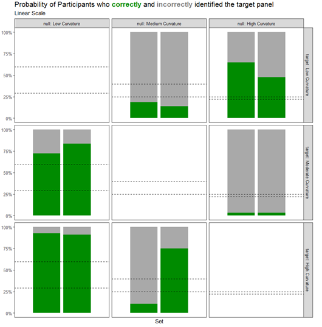
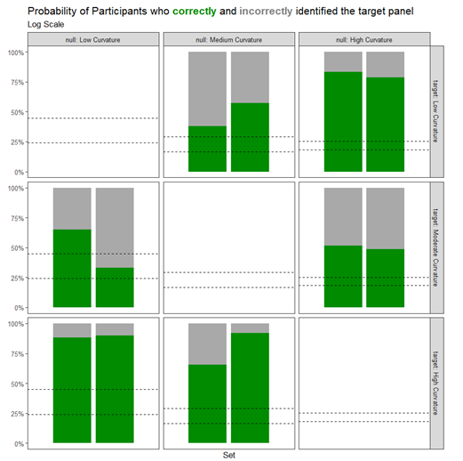

<!-- > To send to Susan during meetings: <https://earobinson95.github.io/logarithmic-lineups/revision-responses-1.pdf> -->

<!-- > Analysis supplementary file: <https://earobinson95.github.io/logarithmic-lineups/supplementary-materials/lineup-analysis.html> -->

<!-- > Revised manuscript: <https://earobinson95.github.io/logarithmic-lineups/logarithmic-lineups-revisions.pdf> -->

<!-- > For Emily to submit: <https://mc.manuscriptcentral.com/jcgs?URL_MASK=f1cfe0d4da184e54b91df29f43be0038> -->

<!-- > Your paper will be printed in black and white.  The online version will be in color but to accommodate printing without color please be sure you \todo{don't refer to color in either the figure captions or text} and that all figures are still interpretable in black and white. -->

All responses to reviewers' comments are written in \response{blue}. A `diffs-3.pdf` file has also been included to show changes.

<!-- \todo{Need to address yet.} \dubcheck{Double check / review.} -->

## Reviewer: 1

**Comments to the Author** I have reviewed this manuscript twice previously. My read is that the authors have done an adequate job with most of the revisions, but that their analysis should make better use of the Rorschach-derived null expectations for each background. See more detail below, along with a few minor comments.

**Line comments:**

+ Pg 2: “Exponential data is one such example of a function that compresses smaller magnitudes into a smaller area; ” I don’t think this is the right wording. Data are (is) not a function, for one. Furthermore, the wording could be clearer. Technically, the data from 1980 to 2000 or so are in a similar area on both linear and log scales; it’s just that the area is horizontal on the linear scale and diagonal on the log scale. Maybe “Exponential data are one such example where, on a linear scale, the separation of data at smaller magnitudes is hard to discern” or something like that. Same comment for the sentence above this one.

\response{Thank you to the reviewer for the suggestion on clarifying our wording for better accuracy. We have taken the reviewer's suggestion and applied it to the previous sentence as indicated.}

+ Pg 2: 1 and 10 are 9 units apart, not 10.

\response{We thank the reviewer's attention to detail. To keep the nature of the sentence while correcting for accuracy, we have adjusted the wording to: "Logarithms facilitate the conversion of multiplicative relationships (where the tangible distance between numbers like 1 \& 10 or 10 \& 100 grows by factors of 10) to additive relationships (displaying these same intervals as equal distances)"}

+ Pg 8: Technically, (yi – theta) has multiplicative errors, but yi does not

\response{Again, we thank the reviewer's attention to detail and have adjusted our wording to indicate the multiplicative errors are applied before the vertical shift occurs. For example: "We simulated data based on a two-parameter exponential function extended with an additional parameter for multiplicative errors and a vertical shift, for a total of four parameters:".}

+ Pg 8: Loses, not looses

\response{Thank you for catching the spelling error, it has been corrected.}

+ Technically, the function has four parameters, including sigma.

\response{In a previous review, the reviewer indicated: '“exponential model,” as used in section 2.1, typically means a model without an intercept: y = aexp(bx) or something similar, without a “c” term like aexp(bx) + c. The theta term in your model is the intercept, so this isn’t the classic exponential model; it’s a model with an exponential term.' Thus, after some extensive review of common terminology in statistics texts, we adjusted our wording to 'the wording from ”exponential model” to ”two-parameter exponential function with a vertical shift” and provided clarity about how the \alpha, \beta, and \theta parameters affect the shape of the curve.' Given this additonal suggestion, we have further edited our wording to "We simulated data based on a two-parameter exponential function extended with an additional parameter for multiplicative errors and a vertical shift, for a total of four parameters:"}

+ Pg 18: You changed “binary” to “biary.” I think it should be “binary.”

\response{Thank you for catching this typo, we have corrected it.}

+ Fig. 7: I suspect the alpha value for low curvature set 2 log scale is 0.72, not 3.72.

\response{Thank you for your comment regarding \alpha in Fig. 7. While \alpha is often less than 1, as the provided methodology in "Statistical Significance Calculations for Scenarios in Visual Inference" by VanderPlas et al. (2021) demonstrates, it can exceed 1 in cases where panel selection probabilities are relatively uniform, indicating that participants distribute their attention more evenly across panels. In the context of the low curvature set 2 lineup, the calculated \alpha = 3.72 reflects this uniformity in participant selections, as seen in the corresponding Rorschach evaluations. We have clarified this in the manuscript to emphasize that higher \alpha values occur when attention is distributed more evenly across panels and confirmed that this value still aligns with our null sampling method and visual evaluations.}

+ Fig. 8: says proportion, shows \%. They should match, and it would also be good if they match Fig. 7. Also, Fig. 7 says “moderate” and Fig. 8 says “med,” which is presumably “medium.” I think they should match.

\response{Thank you for checking for consistency in our labeling and figures. We have updated both Fig. 7 and Fig. 8 to match in \% and are consistent of our use of "Medium".}

+ The addition of the alpha statistic is a good step for incorporating the results of the Rorschach test more clearly into the manuscript. I would also like to see the results from the Rorschach displayed next to and included in the analysis of the target vs. null results. I think that would bolster your case. For example, in target medium vs. null high, the target gets a lower frequency of responses than the most common Rorschach choice for high on the linear scale, but a substantially higher frequency on the log scale. I can see that from flipping back and forth from Fig. 7 to 8, but it would be easier and more persuasive if they were on the same figure. I’ve eyeballed the results and put them in a few tables here, each of which helps me see the null comparison more easily, and each of which emphasizes different aspects.

```{r}
#| out-width: 75%
#| fig-align: center
#| echo: false
knitr::include_graphics("revision-responses-3-table-suggestion.png")
```

The Rorschach test gives you more information that you’re using. You’ve shown the alpha statistics and used those to conclude “the test is fine.” But as this table shows, the null results from the Rorschach differ for the different scenarios, and thus put the other results in greater context. For instance, for the high target against the moderate background, the raw results say that ~35\% of respondents got the right target on a linear scale vs. 75\% on the log scale. That’s a difference, for sure, but it’s much more stark when compared to the null test. 35\% right was only 5\% more than the null – which is not clearly a significant difference – whereas 75\% was 55\% more than the null. That’s a much bigger difference than the raw results suggest. I suggest incorporating the Rorschach results into your main analysis.

\response{We appreciate the reviewer for continually encouraging us to look at the Rorscach results more carefully and incorporate these into our main analysis. We initially included the Rorschachs in the study as our timing of collecting data aligned with "Statistical significance calculations for scenarios in visual inference" by VanderPlas et al., 2021. After discussion amongst authors about the meaning of the selection percentage for the top Rorschach panel, we have updated Figure 8 to include a dotted line indicating the average top Rorschach panel selection and added these findings and implications to the results and discussion sections.}

\response{It is worth it to note that two sets replicate the data generation process and we display the figure used during our discussion below showing the variability occuring due to random variability in the data generation.}

```{r}
#| out-width: 75%
#| fig-align: center
#| echo: false
#| fig-pos: "H"

```

```{r}
#| out-width: 75%
#| fig-align: center
#| echo: false
#| fig-pos: "H"

```

\response{Based on these findings, we also included select lineups in the appendix showing the number of selections per panel, further highlighting how selections are sometimes made due to spurious differences, such as outliers, rather than selections made due to the actual curvature data trends.}


+ Pg. 22: “We found that, in general, participants who correctly identified the target plot were 0.556 (se 0.039) Likert scale points more confident, on average, across all conditions.” More confident than what? Than participants who did not correctly identify the target plot?

\response{Thank you for your question, we have added clarity for the comparison for individuals who are incorrect both in this paragraph and in the appendix.}

## Associate Editor

**Comments to the Author:** (There are no comments.)